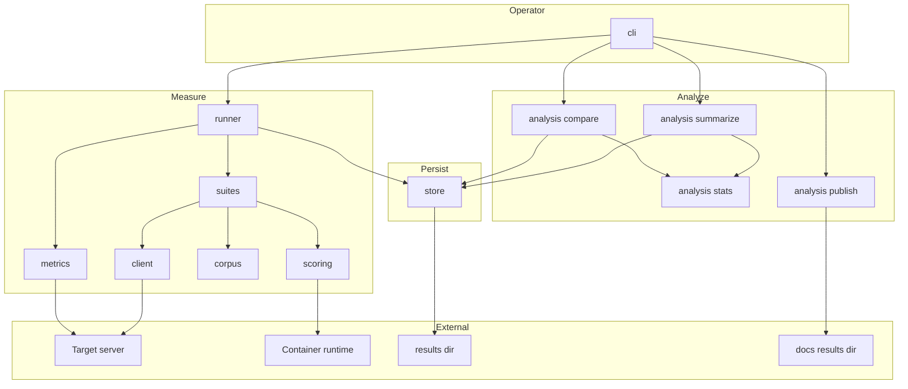
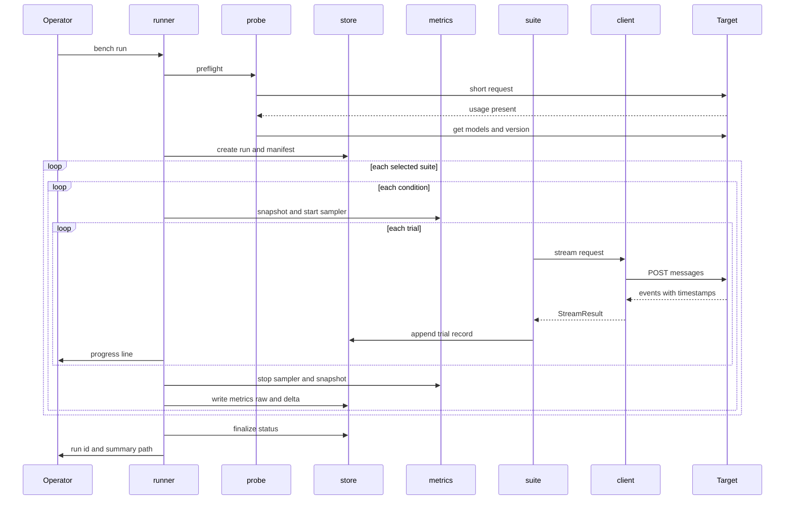
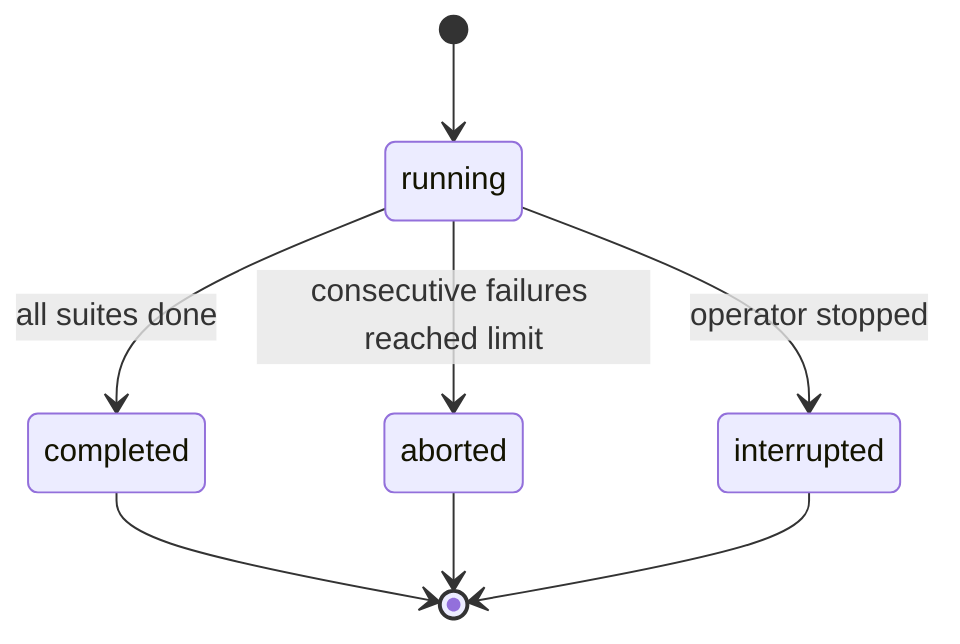
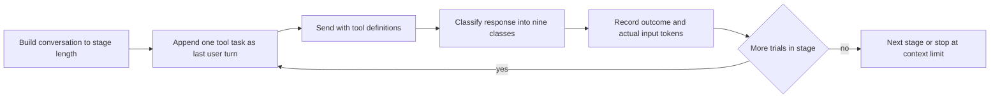

# Design Document: bench-harness

## Overview

**Purpose**: `bench-harness` は、DGX Spark 2 台で動く GLM-5.3-Flash の推論サーバーを、作業用の Mac から Anthropic 互換の `/v1/messages` 経由で測る、コマンドラインの計測の道具である。`PLAN.md` の P1 以降の判断を、すべてこの道具の出す数字で行えるようにする。

**Users**: このリポジトリの開発者 (計測者) が、構成を変えるたびに同じコマンドで測り直し、2 つの計測ランを比べて、差が意味のあるものかを判定するのに使う。

**Impact**: リポジトリに `bench/` (Python のパッケージ)、`docs/results/`、`docs/decisions/`、`LICENSES.md` が加わる。既存のコードはない。

### Goals

- 対象サーバーを差し替えて、同じ入力、同じ手順で何度でも測り直せる
- 測り方そのもののばらつきを数字で示し、2 つの計測ランの差がその範囲かどうかを判定できる (P0 の終わりの条件)
- 失敗、中断、条件の食い違いが、結果を黙って歪めない
- 生データ (本文を含む) と、公開してよい要約を、作りの上で分ける

### Non-Goals

- 対象サーバーの起動、停止、設定の変更、重みの配布
- 成功の基準の数値を決めること
- 72 時間の連続稼働と、復旧の試験 (P6)
- takt そのものを動かす計測
- 常時の監視とダッシュボード (P6)
- サーバーの中で落とされたツール呼び出しの記法を見ること (生の補完の口が要る。P4 の範囲)
- `/v1/chat/completions` や Responses API での計測

## Boundary Commitments

### This Spec Owns

- `bench/` の下の Python のパッケージ `bench_harness` と、そのコマンド `bench`
- 計測に使う合成データの生成器と、その決定性 (同じ設定と種から、同じ入力ができること)
- 生データの形 (`results/<run_id>/` の下のファイルの構成と、各レコードの型)。これは計測と分析の間の契約である
- 要約の形 (`summary.json` と `summary.md`) と、比較の結果の形
- 対象サーバーの定義の形 (`bench/config/targets.toml`) と、計測の設定の形 (`bench/config/profiles.toml`)
- `LICENSES.md` のうち、`bench/` が使う部品と課題の行
- 測り方についての判断の記録 (`docs/decisions/0001-bench-harness-measurement-method.md`)

### Out of Boundary

- 対象サーバーの起動の引数。ただし、計測の前提になるもの (後述の「対象サーバーに求める前提」) は、この設計が文書として示す
- `results/` の保管場所の運用 (バックアップ、共有)
- `docs/results/` に置いた要約の解釈と、成功の基準の判定
- コンテナの実行環境 (Podman または Docker) の導入

### Allowed Dependencies

- 実行時の依存は次の 5 つに限る: `httpx` (BSD-3-Clause)、`httpx-sse` (MIT)、`pydantic` v2 (MIT)、`jsonschema` (MIT)、`prometheus-client` (Apache-2.0)
- 開発時の依存: `pytest`、`pytest-asyncio`、`pytest-httpserver`、`ruff`、`mypy`、`uv`
- 統計、コマンドライン、圧縮、乱数は、Python の標準ライブラリだけで書く。`numpy`、`scipy`、`anthropic` の SDK、Hugging Face のトークナイザーは入れない
- 対象サーバーに対して使ってよい口: `POST /v1/messages`、`POST /v1/messages/count_tokens` (`calibrate` だけ)、`GET /v1/models`、`GET /version`、`GET /metrics`。どれも読み取りか推論で、サーバーの状態を変える口は使わない
- 公開の課題は HumanEval+ (Apache-2.0) だけ。リポジトリには同梱せず、版を固定して取得し、ハッシュを確かめる
- 依存を足すときは、先に `LICENSES.md` に行を足し、ライセンスが MIT、Apache-2.0、BSD、PSF のいずれかであることを確かめる

### Revalidation Triggers

- 生データのレコードの型、またはファイルの構成を変えたとき → 分析 (`analysis/`) の全体と、過去の計測ランとの比較の可否を確かめ直す。`schema_version` を上げる
- 合成データの生成器を変えたとき → `generator_version` を上げる。版が違う計測ランどうしの比較は、9.4 の警告の対象になる
- 条件の鍵 (`decode/code/en` など) の名前を変えたとき → 過去の計測ランと比較できなくなる
- 速さの定義 (どのイベントを最初のトークンと見なすか) を変えたとき → 過去の数字と比べられなくなる。`docs/decisions/` に記録する
- vLLM の `/v1/messages` のイベントやトークン数の項目が変わったとき → `client/` と、偽のサーバーの試験を確かめ直す

## Architecture

### Architecture Pattern & Boundary Map

計測と分析を分ける、2 段のパイプラインにする。計測の側は対象サーバーと話して生データを書くだけで、集計をしない。分析の側は生データだけを読む純粋な関数で、ネットワークに触れない。両者の契約は、生データの形だけである。



**Architecture Integration**:

- **Selected pattern**: 計測と分析を分けるパイプライン。要約を後から作り直せること、途中で止まっても結果が残ること (8.7、10.4)、分析を偽のサーバーなしで試験できることが理由
- **依存の向き**: `types` → `config` → `corpus` / `scoring` / `client` / `metrics` / `store` → `suites` → `runner` → `cli`。`analysis` は `types` と `store` (読み取り) だけに依存し、`client`、`suites`、`runner` を読み込まない。左から右へだけ読み込む。逆向きの読み込みは、レビューで誤りとして扱う
- **Domain boundaries**:
  - `client` は「1 つの要求を送り、時刻とトークン数と中身を返す」だけ。何を測っているかを知らない
  - `suites` は「どの入力を、どの順で、何本同時に送るか」を決める。統計をしない
  - `scoring` は「応答が正しいか」を判定する純粋な関数。ネットワークに触れない (コードの隔離の実行だけが例外)
  - `analysis` は、生データから数字を出す。対象サーバーに触れない
- **New components rationale**: 既存のコードがないので、すべて新規。部品の数は、責任の境目の数に合わせた

### Technology Stack

| Layer | Choice / Version | Role in Feature | Notes |
|-------|------------------|-----------------|-------|
| CLI | Python 3.12 以上、`argparse` | `bench run` / `summarize` / `compare` / `publish` / `calibrate` | 依存を足さない |
| HTTP | `httpx` 0.28、`httpx-sse` 0.4 | `/v1/messages` のストリームの読み取り、`/metrics` の取得 | イベントが届いた時点で時刻を打てる |
| 型と検証 | `pydantic` 2.13、`mypy` (strict) | 設定、生データ、要約の型 | 境界での検証 |
| 引数の検証 | `jsonschema` 4.26 | ツールの引数を、ツールの定義に照らす (6.3) | |
| 指標の解析 | `prometheus-client` 0.26 | `/metrics` のテキストの解析だけに使う | |
| 統計 | 標準ライブラリ (`statistics`、`math`、`random`) | 記述統計、二項の区間、再標本化 | `numpy` / `scipy` を入れない |
| Data / Storage | ファイル (JSON、JSON Lines、gzip) | 生データと要約 | データベースを使わない |
| Infrastructure / Runtime | `uv` 0.12、Podman または Docker | 環境の管理、モデルが書いたコードの隔離 | Docker Desktop は会社の規模により有償 |
| 試験 | `pytest` 9、`pytest-asyncio`、`pytest-httpserver` | 偽のサーバーで、ストリームのタイミングまで再現する | |

## File Structure Plan

### Directory Structure

```
bench/
├── pyproject.toml                  # パッケージの定義、依存の版の固定、ruff と mypy の設定
├── README.md                       # 使い方、対象サーバーに求める前提、各コマンドの例
├── config/
│   ├── targets.toml                # 対象サーバーの定義 (名前、接続先、モデルの名前、メモ、指標の名前の上書き)
│   └── profiles.toml               # 計測の設定 (quick / full)。試行の回数、出力の上限、サンプリング、段階、許容の幅、しきい値
├── src/bench_harness/
│   ├── __init__.py                 # 版
│   ├── types.py                    # 全体で共有する型 (TargetDef、Profile、RunManifest、TrialRecord、StreamResult、Usage など)
│   ├── config.py                   # TOML の読み込みと検証。認証の情報は環境変数から読む
│   ├── client/
│   │   ├── messages.py             # MessagesClient: 1 つの要求をストリームで送り、StreamResult を返す
│   │   └── probe.py                # 疎通の確認、/v1/models の上限、/version の取得
│   ├── metrics/
│   │   └── scrape.py               # /metrics の取得と解析、増分と導出値、計測の間の定期的な読み取り
│   ├── corpus/
│   │   ├── synth.py                # 種から決まる合成の文章 (散文の英語と日本語、コード、ログ) と、先頭の識別子
│   │   ├── tools.py                # ツールの定義の目録と、正解の決まったツール呼び出しの課題の生成
│   │   ├── conversation.py         # takt を模した会話を、狙った長さまで組み立てる
│   │   ├── needle.py               # 干し草と、埋める情報と、問いの生成
│   │   └── humaneval.py            # HumanEval+ を、版を固定して取得し、ハッシュを確かめて読む
│   ├── scoring/
│   │   ├── toolcall.py             # 応答を 9 種類に分ける
│   │   ├── code.py                 # 応答からコードを取り出し、検査と組み合わせる
│   │   ├── sandbox.py              # コンテナの中でコードを動かす (ネットワークなし、読み取り専用)
│   │   ├── needle.py               # 答えの一致の判定
│   │   └── sanity.py               # 出力が壊れている疑い (置き換え文字、同じ語句の繰り返し) の検出
│   ├── suites/
│   │   ├── base.py                 # Suite の約束事、条件の鍵、試行の計画
│   │   ├── decode.py               # 生成速度 (Requirement 2)
│   │   ├── prefill.py              # 入力の処理と最初のトークンまでの時間 (Requirement 3)
│   │   ├── concurrency.py          # 同時処理 (Requirement 4)
│   │   ├── quality.py              # 品質の検査 (Requirement 5)
│   │   └── agent.py                # 長い会話でのツール呼び出し (Requirement 6)
│   ├── runner.py                   # 計測ランの進行: 疎通の確認、まとまりの実行、連続の失敗での停止、進み具合の表示、中断の処理
│   ├── store/
│   │   └── rawstore.py             # 計測ランのディレクトリの作成、試行の書き足し、本文の保存、状態の確定、読み取り
│   ├── analysis/
│   │   ├── stats.py                # 記述統計、正確な二項の区間、再標本化
│   │   ├── summarize.py            # 生データ → summary.json と summary.md
│   │   ├── compare.py              # 2 つの要約と生データ → 比較の結果
│   │   └── publish.py              # 要約だけを docs/results/ に置く
│   └── cli.py                      # コマンドの入口
└── tests/
    ├── fake_server.py              # 偽の /v1/messages と /metrics。イベントの順序、遅れ、失敗を指定できる
    ├── unit/                       # 部品ごとの試験 (ネットワークなし)
    └── integration/                # 偽のサーバーを相手にした、端から端までの試験

docs/
├── decisions/
│   └── 0001-bench-harness-measurement-method.md   # 測り方の判断の記録 (11.6)
└── results/
    └── .gitkeep                    # 公開する要約の置き場所

LICENSES.md                         # 部品と課題の、名前、版、入手先、ライセンス、用途
```

### Modified Files

- `.gitignore` — `bench/.venv/`、`bench/data-cache/` (取得した HumanEval+ の置き場所) を足す。`results/` はすでに入っている

> 1 つのファイルに 1 つの責任を持たせる。`suites/` の 5 つのファイルは同じ約束事 (`base.py`) に従い、互いを読み込まない。このため、5 つは並行して実装できる。

## System Flows

### 計測ランの進行



- 疎通の確認 (1.3) で、応答にトークン数がなければ、計測ランのディレクトリを作る前に終了する (1.4)
- 内部の指標は、条件ごとの前後で読む (7.1 の「まとまりごと」より細かい粒度。まとまりの前後の増分は、条件の増分を足せば出るので、別には読まない)。言語ごとの当たり率を出すのに要る。増分が混ざらないよう、始める前に実行中の要求の数を読み、0 でなければ警告を記録する
- 試行のレコードは、1 つ終わるたびに書いて、ディスクに同期する (8.7)

### 計測ランの状態



- `running` のまま残っている計測ランは、異常終了として扱う。`completed` 以外はすべて「未完了」で、要約と比較の先頭に警告が出る (10.4、10.5)

### 長い会話の検査の 1 段階



- 1 段階の中の試行は、同じ会話の前置きを共有し、最後の 1 手 (課題) だけが違う。takt が同じ前置きを送り続ける使い方に合わせ、プレフィックスキャッシュに当てて時間を抑える
- 1 本の会話への偏りを避けるため、1 段階につき複数の会話 (既定 5 本、種が違う) を使い、試行を均等に割り振る
- 同じ種の会話は、長い段階のものが、短い段階のものをそのまま先頭に含む。段階が進んでも、前の段階で対象サーバーに入った前置きのキャッシュに当たるので、長い段階の 1 回目の試行の待ち時間を抑えられる

## Requirements Traceability

| Requirement | Summary | Components | Interfaces | Flows |
|-------------|---------|------------|------------|-------|
| 1.1 | 名前の付いた対象サーバーの定義を複数持ち、選ぶ | config、cli | `TargetDef`、`load_targets` | — |
| 1.2 | 選んだまとまりだけを実行する | cli、runner | `RunRequest.suites` | 計測ランの進行 |
| 1.3 | 始める前に短い要求で確かめる | client/probe、runner | `preflight` | 計測ランの進行 |
| 1.4 | 前提が満たされなければ、始めずに理由を示す | client/probe、cli | `PreflightFailure` | 計測ランの進行 |
| 1.5 | 重ならない識別子 | store | `new_run_id` | — |
| 1.6 | 実行の条件を記録する | store、runner | `RunManifest` | — |
| 1.7 | 進み具合を示す | runner | `ProgressSink` | 計測ランの進行 |
| 1.8 | 認証の情報を書き出さない | config、client/messages、store | `TargetDef.api_key_env`、`StoredRequest` | — |
| 2.1 | 4 つの条件 | suites/decode、corpus/synth | 条件の鍵 `decode/{kind}/{lang}` | — |
| 2.2 | 10 回以上、増やせる | config、suites/decode | `Profile.decode.trials` (最小 10) | — |
| 2.3 | 最初のトークンまでの時間を含めない速さ | client/messages、analysis/summarize | `StreamResult.timing`、`decode_tps` | — |
| 2.4 | サンプル数、平均、中央値、最小、最大、ばらつき | analysis/stats | `describe` | — |
| 2.5 | 慣らしの試行を分ける | suites/base、analysis/summarize | `TrialRecord.warmup` | — |
| 2.6 | 早く終わった試行に印 | suites/decode、analysis/summarize | `TrialFlag.SHORT_OUTPUT` | — |
| 2.7 | 同じ条件で同じ設定 | suites/base | `ConditionPlan.sampling`、`max_tokens` | — |
| 3.1 | 8k、32k、128k で 2 つの値 | suites/prefill | 条件の鍵 `prefill/{cold,warm}/{len}` | — |
| 3.2 | 実際の入力のトークン数を使う | client/messages | `Usage.total_input_tokens` | — |
| 3.3 | 許容の幅を超えたら印 | suites/base | `TrialFlag.LENGTH_OFF_TARGET` | — |
| 3.4 | 先頭が重ならない入力 | corpus/synth | `prefix_nonce` | — |
| 3.5 | キャッシュが効く条件を分ける | suites/prefill | 条件の鍵 `prefill/warm/*` | — |
| 3.6 | 上限より長い条件を飛ばす | client/probe、suites/base | `ContextLimit`、`SkippedCondition` | — |
| 3.7 | サンプル数、平均、中央値、最小、最大、ばらつき | analysis/stats | `describe` | — |
| 4.1 | 1、2、4、8 本、選べる | config、suites/concurrency | `Profile.concurrency.levels` | — |
| 4.2 | 1 本あたり、合計、1 本ごとの最初のトークンまでの時間 | suites/concurrency、analysis/summarize | `round_id`、`stream_index` | — |
| 4.3 | 同じ時刻に送り始め、時刻を記録 | suites/concurrency、client/messages | `StreamTiming.sent_at_ns` | — |
| 4.4 | 主な結果と参考を分ける | analysis/summarize | `MetricResult.tier` | — |
| 4.5 | 一部が失敗したら明記 | analysis/summarize | `MetricResult.flags` | — |
| 5.1 | ツール呼び出しの正確さ | suites/quality、corpus/tools、scoring/toolcall | `classify_tool_call` | — |
| 5.2 | コードの課題 | suites/quality、corpus/humaneval、scoring/code | `score_code` | — |
| 5.3 | 長さと位置ごとの、探す課題 | suites/quality、corpus/needle、scoring/needle | 条件の鍵 `quality/needle/{len}/d{depth}` | — |
| 5.4 | コードを隔離して動かす | scoring/sandbox | `SandboxRunner` | — |
| 5.5 | 公開の課題の名前、版、採点の方法 | corpus/humaneval、store | `DatasetRef` | — |
| 5.6 | 分母と分子を添える | analysis/stats、analysis/summarize | `ProportionStat` | — |
| 5.7 | 採点できなかった件数を分ける | suites/quality、analysis/summarize | `QualityOutcome.NOT_SCORED` | — |
| 6.1 | 会話を段階的に伸ばす | suites/agent、corpus/conversation | `build_conversation` | 長い会話の検査の 1 段階 |
| 6.2 | ツールを実際には実行しない | corpus/conversation | 合成の `tool_result` | 長い会話の検査の 1 段階 |
| 6.3 | 9 種類に分ける | scoring/toolcall | `ToolCallOutcome` | 長い会話の検査の 1 段階 |
| 6.4 | 段階ごとの件数と割合 | analysis/summarize | `AgentStageResult` | — |
| 6.5 | 不確かさの幅と、試行の数の十分さ | analysis/stats | `binomial_interval`、`threshold_verdict` | — |
| 6.6 | しきい値を初めて超えた長さ | analysis/summarize | `AgentSummary.first_exceeded_tokens` | — |
| 6.7 | 実際の入力のトークン数で長さを記録 | client/messages、suites/agent | `Usage.total_input_tokens` | — |
| 6.8 | 試行の数と刻みを変えられる | config | `Profile.agent` | — |
| 6.9 | 上限に達したら止める | suites/agent、client/probe | `SkippedCondition` | 長い会話の検査の 1 段階 |
| 7.1 | 前後で読んで増分を求める | metrics/scrape、runner | `snapshot`、`delta` | 計測ランの進行 |
| 7.2 | 5 種類の値を取り出す | metrics/scrape | `MetricMap` | — |
| 7.3 | 当たり率と、1 ステップあたりのトークン | metrics/scrape | `DerivedMetrics` | — |
| 7.4 | 得られなくても続ける | metrics/scrape | `MetricsUnavailable`、`missing` | — |
| 7.5 | 加工する前の形を残す | store | `write_metrics_raw` | — |
| 8.1 | すべての要求の生データを残す | store | `TrialRecord`、`put_body` | — |
| 8.2 | 人が読む要約と、道具が読む要約 | analysis/summarize | `summary.md`、`summary.json` | — |
| 8.3 | 要約に本文を含めない | types、analysis/summarize | `Summary` の型に本文の項目がない | — |
| 8.4 | 指示されたときだけ公開 | analysis/publish、cli | `bench publish` | — |
| 8.5 | 生データを管理の対象に書かない | store、config | `results_root` の検査 | — |
| 8.6 | 要約の先頭に実行の条件 | analysis/summarize | `Summary.conditions` | — |
| 8.7 | 試行ごとに書き足す | store | `append_trial` | 計測ランの進行 |
| 9.1 | 両方の値、差、差の割合 | analysis/compare | `ComparisonRow` | — |
| 9.2 | ばらつきの範囲かどうかの判定 | analysis/stats、analysis/compare | `diff_verdict` | — |
| 9.3 | 収まらなかった条件の一覧と結論 | analysis/compare | `ComparisonReport.repeatability` | — |
| 9.4 | 条件が違えば先頭で警告 | analysis/compare | `ComparisonReport.warnings` | — |
| 9.5 | 片方にしかない条件を外して示す | analysis/compare | `ComparisonReport.excluded` | — |
| 9.6 | 割合の比較に不確かさの幅を使う | analysis/stats、analysis/compare | `proportion_diff_verdict` | — |
| 10.1 | 失敗と時間切れを集計から外して数える | client/messages、analysis/summarize | `TrialStatus`、`TimeoutPolicy` | — |
| 10.2 | 試行が足りない印 | analysis/summarize | `MetricFlag.INSUFFICIENT_TRIALS` | — |
| 10.3 | 失敗が続いたら止める | runner | `FailureBreaker` | 計測ランの状態 |
| 10.4 | 途中で止まっても結果を残し、未完了と記録 | runner、store | `RunStatus` | 計測ランの状態 |
| 10.5 | 未完了を比較の先頭で警告 | analysis/compare | `ComparisonReport.warnings` | — |
| 10.6 | 自動でやり直さない | client/messages | やり直しの仕組みを持たない | — |
| 10.7 | 出力が壊れている疑いに印を付け、件数を示す | scoring/sanity、suites/base、analysis/summarize | `detect_output_anomalies`、`MetricFlag.SUSPECT_OUTPUTS` | — |
| 11.1 | 合成データと、使えるライセンスの課題だけ | corpus 全体 | `DatasetRef.license` | — |
| 11.2 | 課題とデータを `LICENSES.md` に記録 | `LICENSES.md`、corpus/humaneval | — | — |
| 11.3 | 部品を `LICENSES.md` に記録 | `LICENSES.md`、`pyproject.toml` | — | — |
| 11.4 | 合成データを同じ指定から作り直せる | corpus/synth | `generator_version`、`seed` | — |
| 11.5 | クリーンルーム | 開発の進め方 (`docs/decisions/0001`) | — | — |
| 11.6 | 測り方の判断を残す | `docs/decisions/0001` | — | — |

## Components and Interfaces

| Component | Domain/Layer | Intent | Req Coverage | Key Dependencies (P0/P1) | Contracts |
|-----------|--------------|--------|--------------|--------------------------|-----------|
| types | 共有 | 全体で使う型 | 1.6、8.3 | pydantic (P0) | State |
| config | 共有 | 設定の読み込みと検証 | 1.1、1.8、2.2、4.1、6.8、8.5 | types (P0) | Service |
| client/messages | 計測 | 1 つの要求を送り、時刻と中身を返す | 1.8、2.3、3.2、4.3、6.7、10.1、10.6 | httpx、httpx-sse (P0) | Service、API |
| client/probe | 計測 | 疎通、上限、版の確認 | 1.3、1.4、3.6、6.9 | client/messages (P0) | Service |
| metrics/scrape | 計測 | 内部の指標の取得、増分、導出 | 7.1〜7.4 | prometheus-client (P0) | Service |
| corpus/* | 計測 | 決定的な入力の生成 | 2.1、3.4、5.1〜5.3、5.5、6.1、6.2、11.1、11.4 | types (P0) | Service |
| scoring/toolcall | 計測 | 応答の分類 | 5.1、6.3 | jsonschema (P0) | Service |
| scoring/sandbox | 計測 | コードの隔離の実行 | 5.4 | Podman または Docker (P1) | Service |
| scoring/sanity | 計測 | 出力が壊れている疑いの検出 | 10.7 | なし | Service |
| suites/* | 計測 | 条件と試行の計画、実行 | 2〜6 | client、corpus、scoring (P0) | Service |
| runner | 計測 | 計測ランの進行 | 1.2、1.3、1.7、7.1、10.3、10.4 | suites、store、metrics (P0) | Service、State |
| store/rawstore | 保存 | 生データの読み書き | 1.5、1.6、7.5、8.1、8.5、8.7 | types (P0) | Service、State |
| analysis/stats | 分析 | 統計の純粋な関数 | 2.4、3.7、5.6、6.5、9.2、9.6 | なし | Service |
| analysis/summarize | 分析 | 生データ → 要約 | 2.3〜2.6、4.2、4.4、4.5、6.4、6.6、8.2、8.3、8.6、10.1、10.2、10.7 | store、stats (P0) | Batch |
| analysis/compare | 分析 | 2 つの計測ランの比較 | 9.1〜9.6、10.5 | store、stats (P0) | Batch |
| analysis/publish | 分析 | 要約の公開 | 8.4 | store (P0) | Batch |
| cli | 入口 | コマンド | 1.1、1.2、1.4、8.4 | 上のすべて | — |

### 共有

#### types / config

| Field | Detail |
|-------|--------|
| Intent | 全体で共有する型と、設定の読み込み |
| Requirements | 1.1、1.6、1.8、2.2、4.1、6.8、8.3、8.5 |

**Responsibilities & Constraints**

- `types.py` は、ほかのどのモジュールも読み込まない
- 認証の情報は、対象サーバーの定義には **環境変数の名前** だけを書く (`api_key_env`)。値は `config.py` が実行時に環境変数から読み、`SecretStr` で持つ。`SecretStr` は、JSON に書き出すと伏せ字になる
- `results_root` は、既定で、リポジトリの直下の `results/`。`config.py` は、その場所が git の管理の対象でないこと (`git check-ignore` が通ること、またはリポジトリの外であること) を確かめ、そうでなければ計測を始めない (8.5)
- 設定の値には下限を持たせる。`decode.trials` は 10 以上 (2.2)

**Contracts**: Service [x] / State [x]

##### 主な型

```python
class TargetDef(BaseModel):
    name: str
    base_url: HttpUrl                       # 例: http://10.0.1.60:8001
    model: str                              # 要求に入れるモデルの名前
    notes: str = ""                         # 計測者が書く構成のメモ
    api_key_env: str | None = None          # 認証の情報を入れた環境変数の名前
    metrics_url: HttpUrl | None = None      # 既定は base_url + /metrics
    max_context_tokens: int | None = None   # /v1/models から得られないときの値
    metric_map: dict[LogicalMetric, str] = {}   # 既定の名前の上書き
    tool_markup_markers: list[str] = ["<tool_call>", "</tool_call>", "<arg_key>", "<arg_value>"]

class Sampling(BaseModel):
    temperature: float = 0.0
    top_p: float | None = None
    top_k: int | None = None
    thinking: Literal["server_default"] = "server_default"   # 選べるのは、対象サーバーの既定だけ (2026-09-20 に実機で、/v1/messages からは切り替えられないと確かめた。タスク 8.4)

class Usage(BaseModel):
    input_tokens: int
    output_tokens: int
    cache_read_input_tokens: int | None = None
    cache_creation_input_tokens: int | None = None

    @property
    def total_input_tokens(self) -> int: ...   # input + cache_read + cache_creation (欠けた項は 0)

class RunStatus(StrEnum):
    RUNNING = "running"; COMPLETED = "completed"; ABORTED = "aborted"; INTERRUPTED = "interrupted"

class RunManifest(BaseModel):
    schema_version: int
    run_id: str
    status: RunStatus
    target: TargetDef                       # 認証の情報の値は含まない
    server_model: str | None                # 対象サーバーが返したモデルの名前
    server_version: str | None              # GET /version
    started_at: datetime; finished_at: datetime | None
    suites: list[SuiteName]
    profile_name: str
    profile: Profile                        # サンプリング、出力の上限、試行の回数を含む、解決済みの設定
    harness_version: str                    # パッケージの版 + git のコミット + 未コミットの変更の有無
    generator_version: int
    context_limit: int | None
    warnings: list[str]
    skipped: list[SkippedCondition]
```

- `Profile` は、まとまりごとの設定 (`decode`、`prefill`、`concurrency`、`quality`、`agent`) と、共通の設定 (`timeout`、`min_successes`、`max_consecutive_failures`、`length_tolerance`、`compare_tolerance`、`agent.threshold`) を持つ。`quick` と `full` の 2 つを最初から入れておく

### 計測

#### client/messages

| Field | Detail |
|-------|--------|
| Intent | 1 つの要求をストリームで送り、イベントごとの時刻、トークン数、中身、失敗を返す |
| Requirements | 1.8、2.3、3.2、4.3、6.7、10.1、10.6 |

**Responsibilities & Constraints**

- 何を測っているかを知らない。やり直しの仕組みを持たない (10.6)
- 例外を投げない。通信の失敗、HTTP のエラー、`event: error`、時間切れは、すべて `StreamResult.error` として返す
- 時刻は 2 種類を持つ。経過の計算には単調な時計 (`time.perf_counter_ns`)、記録には UTC の時刻
- 知らないイベントと、知らない項目は無視する。`ping` の有無や、ブロックの順序に依存しない
- 認証の情報は `Authorization: Bearer` と `x-api-key` の両方に付ける。`StreamResult` には含めない

**Dependencies**

- External: httpx、httpx-sse — ストリームの読み取り (P0)
- External: 対象サーバーの `POST /v1/messages` (P0)

**Contracts**: Service [x] / API [x]

##### Service Interface

```python
class TimeoutPolicy(BaseModel):
    connect_s: float
    first_event_s: float        # 最初のイベントまで。長い入力では大きくする
    idle_s: float               # イベントの間隔。ping がないので、これで止まったことを検出する
    total_s: float

class StreamTiming(BaseModel):
    sent_at_utc: datetime
    sent_at_ns: int                     # 要求を送り始めた時刻 (単調)
    message_start_ns: int | None
    first_token_ns: int | None          # 最初の content_block_delta (種類を問わない)
    first_text_ns: int | None           # 最初の text_delta
    last_token_ns: int | None           # 最後の content_block_delta
    end_ns: int                         # message_stop、または失敗の時刻
    event_count: int

class ContentBlock(BaseModel):
    type: Literal["text", "thinking", "tool_use"]
    text: str | None = None
    tool_name: str | None = None
    tool_input_raw: str | None = None   # input_json_delta をつないだ、解析する前の文字列
    tool_input: dict[str, JsonValue] | None = None   # 解析できたときだけ

class RequestError(BaseModel):
    kind: Literal["connect", "http", "stream_error", "timeout_first", "timeout_idle", "timeout_total", "protocol"]
    http_status: int | None
    message: str

class StreamResult(BaseModel):
    timing: StreamTiming
    usage: Usage | None
    stop_reason: str | None
    blocks: list[ContentBlock]
    server_model: str | None
    error: RequestError | None

class MessagesClient(Protocol):
    async def stream(self, request: MessagesRequest, timeout: TimeoutPolicy) -> StreamResult: ...
```

- Preconditions: `request.stream` は常に真。`request.max_tokens` は 1 以上
- Postconditions: `error` が `None` なら、`usage`、`first_token_ns` (出力が 1 トークン以上のとき)、`stop_reason` が入っている。`usage` は `message_delta` の値を正とし、来なかったときだけ `message_start` の値を使う
- Invariants: `sent_at_ns <= message_start_ns <= first_token_ns <= last_token_ns <= end_ns`

##### 速さの定義 (この設計が固定する)

| 値 | 定義 |
|---|---|
| 最初のトークンまでの時間 | `first_token_ns - sent_at_ns`。thinking の最初のトークンも、最初のトークンに数える |
| 最初の本文までの時間 | `first_text_ns - sent_at_ns`。参考として別に記録する |
| 生成速度 | `(output_tokens - 1) / (last_token_ns - first_token_ns)`。最初のトークンまでの時間を含めない (2.3) |
| 入力の処理速度 | `total_input_tokens / (first_token_ns - sent_at_ns)` (3.1、3.2) |

- `output_tokens` が 16 未満の試行は、生成速度の集計に入れない (分母が小さすぎて値が荒れる)。件数は印として示す

##### API Contract

| Method | Endpoint | Request | Response | Errors |
|--------|----------|---------|----------|--------|
| POST | `/v1/messages` | `model`、`max_tokens`、`messages`、`system`、`tools`、`temperature`、`top_p`、`top_k`、`stream: true` | SSE のイベントの列 | 400 (上限の超過など)、401、5xx、`event: error` |

- `tool_choice` は送らない (サーバーが `auto` を付ける)。`stop_sequences` も送らない
- thinking は、対象サーバーの既定のままにして、その旨を実行の条件に記録する。2026-09-20 に実機 (EXL3 の構成) で確かめたところ、`/v1/messages` からは切り替えられなかった (Anthropic の形の `thinking` も、`chat_template_kwargs` の `enable_thinking` も、出力を変えなかった) ので、設定の選択肢を `server_default` だけに絞った (タスク 8.4)。要求の本文には、thinking に関わる項目を 1 つも入れない。切り替えが効く構成が見つかったら、その構成で実測した渡し方と一緒に、選択肢を足し直す

#### client/probe

| Field | Detail |
|-------|--------|
| Intent | 計測の前提を確かめ、対象サーバーの上限と版を得る |
| Requirements | 1.3、1.4、3.6、6.9 |

```python
class PreflightOk(BaseModel):
    server_model: str | None
    server_version: str | None
    context_limit: int | None       # /v1/models の max_model_len → TargetDef.max_context_tokens → None
    running_requests: int | None    # 始める前の、実行中の要求の数

class PreflightFailure(BaseModel):
    unmet: Literal["unreachable", "http_error", "no_usage", "no_output"]
    detail: str

async def preflight(client: MessagesClient, target: TargetDef) -> PreflightOk | PreflightFailure: ...
```

- `GET /v1/models` と `GET /version` は、失敗しても前提の不足にはしない (値が `None` になるだけ)
- 上限を超える条件は、送る前に飛ばす (3.6)。上限がわからないときは送り、HTTP 400 が返ったら、その条件を「上限に達した」として飛ばす。エラーのメッセージは理由として残すが、解析はしない

#### metrics/scrape

| Field | Detail |
|-------|--------|
| Intent | 内部の指標を読み、増分と導出値を出す。得られなくても計測を止めない |
| Requirements | 7.1、7.2、7.3、7.4 |

```python
class LogicalMetric(StrEnum):
    SPEC_DRAFTS = ...; SPEC_DRAFT_TOKENS = ...; SPEC_ACCEPTED_TOKENS = ...
    PREFIX_QUERIES = ...; PREFIX_HITS = ...
    KV_USAGE = ...; RUNNING_REQUESTS = ...
    PROMPT_TOKENS = ...; GENERATION_TOKENS = ...
    ITERATION_TOKENS_SUM = ...; ITERATION_TOKENS_COUNT = ...; PREEMPTIONS = ...

class MetricSnapshot(BaseModel):
    taken_at_utc: datetime
    raw_text: str                                   # 加工する前の形 (7.5)
    values: dict[LogicalMetric, float]
    missing: list[LogicalMetric]

class MetricsUnavailable(BaseModel):
    reason: str

class DerivedMetrics(BaseModel):
    spec_acceptance_rate: float | None              # 当たったトークン ÷ 下書きしたトークン
    mean_acceptance_length: float | None            # 1 + 当たったトークン ÷ 下書きの回数
    decode_steps: float | None                      # ITERATION_TOKENS_COUNT の増分
    tokens_per_step: float | None                   # ITERATION_TOKENS_SUM の増分 ÷ COUNT の増分
    prefix_cache_hit_rate: float | None             # PREFIX_HITS の増分 ÷ PREFIX_QUERIES の増分
    kv_usage_peak: float | None                     # 計測の間に定期的に読んだ値の最大
    preemptions: float | None
    missing: list[LogicalMetric]

class MetricsScraper(Protocol):
    async def snapshot(self) -> MetricSnapshot | MetricsUnavailable: ...
    def start_sampler(self, interval_s: float) -> None: ...
    async def stop_sampler(self) -> float | None: ...       # KV の使用率の最大

def derive(before: MetricSnapshot, after: MetricSnapshot, kv_peak: float | None) -> DerivedMetrics: ...
```

- 既定の名前の対応は vLLM の V1 のもの (`research.md` の表)。`TargetDef.metric_map` で上書きできる
- 分母が 0 の導出値は `None` にする (0 で割らない)

#### corpus

| Field | Detail |
|-------|--------|
| Intent | 設定と種から、いつでも同じ入力を作る |
| Requirements | 2.1、3.4、5.1、5.2、5.3、5.5、6.1、6.2、11.1、11.4 |

**Responsibilities & Constraints**

- 乱数は `random.Random(seed)` だけを使う。時刻、環境、辞書の順序に依存しない。`generator_version` と `seed` と引数が同じなら、出力はバイト単位で同じになる (11.4)
- 入力の長さは、内容の種類ごとの「1 トークンあたりの文字数」(`Profile.chars_per_token`) から、文字数で狙う。実際のトークン数は応答から記録する。比は `bench calibrate` で測り直せる
- 先頭の識別子 (`prefix_nonce`) は 16 進 32 文字。システムプロンプトの 1 行目に入れる。キャッシュが効かない条件では `hash(seed, 条件の鍵, 試行の番号, run_id)` から、効く条件では `hash(seed, 条件の鍵)` から作る
- 合成の文章は、語の並べ替えではなく、型紙 (作業の報告、チケット、ログ、コードのファイル) に値を埋めて作る。自然な文章に近いほうが、トークン数の比と、投機的デコードの当たり率が安定する

```python
class SyntheticCorpus(Protocol):
    def prose(self, lang: Literal["en", "ja"], target_tokens: int, seed: int) -> str: ...
    def code(self, target_tokens: int, seed: int) -> str: ...
    def log(self, target_tokens: int, seed: int) -> str: ...
    def prefix_nonce(self, *parts: str | int) -> str: ...

class ToolTask(BaseModel):
    prompt: str                                 # 最後の 1 手として送る指示
    tools: list[ToolDef]                        # この課題で渡すツールの定義 (input_schema を含む)
    expected_tool: str
    expected_input: dict[str, JsonValue]        # 指示の中に文字どおり現れる値だけで決まる

def make_tool_task(index: int, seed: int) -> ToolTask: ...
def build_conversation(target_tokens: int, conversation_seed: int) -> ConversationPrefix: ...
def make_needle_case(target_tokens: int, depth_pct: int, index: int, seed: int) -> NeedleCase: ...
def load_humaneval_plus(cache_dir: Path) -> tuple[DatasetRef, list[CodeProblem]]: ...
```

- ツールの課題は、正解が 1 つに決まるように作る。引数の値 (識別子、パス、数、列挙の値) は、指示の中に文字どおり書く。呼ぶべきツールは 1 つだけで、似た名前のツールを目録に混ぜる
- `build_conversation` は、takt の作業を模す。同じ前置き (システムプロンプトとツールの定義) のあとに、「指示 → ツール呼び出し → 合成の結果」を、狙った長さになるまで繰り返す。ツールの結果は、合成のファイルの中身とコマンドの出力で、実際には何も実行しない (6.2)
- `load_humaneval_plus` は、取得元の URL、版、SHA-256 を定数で持ち、ハッシュが合わなければ失敗する。`DatasetRef` (名前、版、ライセンス、採点の方法) を返し、計測ランに記録する (5.5)

#### scoring/toolcall

| Field | Detail |
|-------|--------|
| Intent | 応答を、9 種類のどれか 1 つに分ける |
| Requirements | 5.1、6.3 |

```python
class ToolCallOutcome(StrEnum):
    CORRECT = "correct"
    NO_CALL = "no_call"                     # 呼ぶべきなのに呼ばなかった
    UNKNOWN_TOOL = "unknown_tool"           # 定義にないツールの名前
    ARGS_UNPARSEABLE = "args_unparseable"   # 引数が読み取れない
    ARGS_SCHEMA_INVALID = "args_schema_invalid"   # 引数が定義に合わない
    MARKUP_LEAKED = "markup_leaked"         # 呼び出しの記法が本文に漏れた
    WRONG_CALL = "wrong_call"               # 呼ぶツールまたは引数の中身が違う
    EMPTY_OR_TRUNCATED = "empty_or_truncated"
    REQUEST_FAILED = "request_failed"

class ToolCallVerdict(BaseModel):
    outcome: ToolCallOutcome
    detail: str                             # 例: "extra_calls=2"、"missing required: path"

def classify_tool_call(result: StreamResult, task: ToolTask, markers: list[str]) -> ToolCallVerdict: ...
```

分類は、上から順に最初に当てはまったものにする (1 つの応答は、必ず 1 つの種類になる)。

1. `result.error` がある → `REQUEST_FAILED`
2. ブロックが 1 つもない、または `stop_reason` が `max_tokens` → `EMPTY_OR_TRUNCATED`
3. `tool_use` のブロックがなく、本文に記法の目印 (`markers`) が含まれる → `MARKUP_LEAKED`
4. `tool_use` のブロックがない → `NO_CALL`
5. 最初の `tool_use` の名前が、渡したツールの定義にない → `UNKNOWN_TOOL`
6. `tool_input_raw` が JSON として読めない → `ARGS_UNPARSEABLE`
7. 引数が、そのツールの `input_schema` に合わない (`jsonschema`) → `ARGS_SCHEMA_INVALID`
8. ツールの名前または引数が、正解と違う。または `tool_use` が 2 つ以上ある → `WRONG_CALL`
9. それ以外 → `CORRECT`

- 「崩れた割合」(6.4) は、`CORRECT` と `REQUEST_FAILED` を除いた 7 種類の件数 ÷ (全体 − `REQUEST_FAILED`)。要求そのものの失敗は、モデルの崩れではないので分母から外し、件数を別に示す
- GLM と `glm47` のパーサーの組み合わせでは、壊れた記法はサーバーの中で落とされるので、`MARKUP_LEAKED` と `ARGS_UNPARSEABLE` は出にくい。`NO_CALL` と `EMPTY_OR_TRUNCATED` に現れる見込みである

#### scoring/sandbox

| Field | Detail |
|-------|--------|
| Intent | モデルが書いたコードを、Mac のファイルとネットワークに触れられない形で動かす |
| Requirements | 5.4 |

```python
class SandboxResult(BaseModel):
    passed: bool
    timed_out: bool
    exit_code: int | None
    stderr_tail: str

class SandboxUnavailable(BaseModel):
    reason: str

class SandboxRunner(Protocol):
    def available(self) -> bool | SandboxUnavailable: ...
    def run_python(self, source: str, timeout_s: float) -> SandboxResult: ...
```

- 実行環境は `podman` か `docker`。設定で選ぶ。指定がなければ `podman`、`docker` の順に探す
- 起動の引数を固定する: ネットワークなし (`--network none`)、読み取り専用のルート (`--read-only`)、作業用の一時領域だけ書き込み可 (`--tmpfs`)、ホストのディレクトリをマウントしない、権限の昇格を禁じる、メモリとプロセスの数と CPU に上限、実行のたびに使い捨て (`--rm`)
- コードは標準入力で渡す。ホストのファイルを経由しない
- イメージは、公式の Python のスリムなイメージ (ダイジェストで固定) に numpy だけを足した、自前のイメージにする (`bench/sandbox/Dockerfile`。numpy は版とホイールのハッシュで固定)。HumanEval+ の検査のプログラムが、164 問のうち 163 問で numpy を使うためである (タスク 6.1 で確かめた)。設定の `sandbox.image_digest` には、作ったイメージの識別子 (`docker image inspect --format '{{.Id}}'`) を書き、採点の側は、手元のイメージの識別子がこれと合わなければ、使えないものとして扱う (合わないイメージでは動かさない)。識別子を計測ランに記録する
- 時間切れのときは、コンテナそのものを止める。`docker run` のプロセスを殺しても、コンテナは動き続ける (タスク 6.1 で確かめた)。コンテナに名前を付けて起動し、時間切れと中断のときに `kill` する
- 実行環境がないときは、コードの課題を飛ばし、理由を残す。隔離なしでは動かさない

#### scoring/sanity

| Field | Detail |
|-------|--------|
| Intent | 応答の本文が壊れている疑いを、機械的に見つける |
| Requirements | 10.7 |

```python
def detect_output_anomalies(text: str, repeat_min_chars: int, repeat_min_count: int) -> list[TrialFlag]: ...
```

- `REPLACEMENT_CHAR`: 本文 (thinking を含む) に U+FFFD が 1 つでもある
- `REPETITION_LOOP`: `repeat_min_chars` (既定 12) 文字以上の同じ並びが、間を空けずに `repeat_min_count` (既定 8) 回以上続く
- すべてのまとまりの、すべての試行に、`suites/base.py` が共通でかける。印の付いた試行は集計から外さない (見つけ方が機械的で、コードやログのような繰り返しの多い出力を誤って拾うことがあるため)。代わりに、その条件の結果に `SUSPECT_OUTPUTS` と件数を付け、計測者が生データを見て判断できるようにする
- 背景: 上流に、GB10 の TP=2 の並行バッチで非 ASCII の生成が壊れる、という未解決の問題がある (vLLM #57087)。壊れた出力が高速に出ると、速さの数字だけが良く見える

#### suites

| Field | Detail |
|-------|--------|
| Intent | 条件と試行を計画し、実行して、試行のレコードを返す |
| Requirements | 2.1〜2.7、3.1〜3.7、4.1〜4.5、5.1〜5.7、6.1〜6.9 |

```python
class ConditionPlan(BaseModel):
    key: str                        # 例: "decode/code/en"、"prefill/cold/32k"、"agent/stage/040k"
    tier: Literal["primary", "reference"]
    trials: int
    warmup_trials: int
    sampling: Sampling
    max_tokens: int
    concurrency: int = 1
    target_input_tokens: int | None = None

class TrialRecord(BaseModel):
    schema_version: int
    run_id: str
    suite: SuiteName
    condition: str
    trial_index: int                # 同じ番号なら、必ず同じ入力
    warmup: bool
    round_id: int | None            # 同時処理の 1 回ぶん
    stream_index: int | None
    request_body_ref: str           # 本文の保存先 (内容のハッシュ)
    result: StreamResult            # 応答の本文を含む
    flags: list[TrialFlag]          # SHORT_OUTPUT、LENGTH_OFF_TARGET、TOO_FEW_OUTPUT_TOKENS、REPLACEMENT_CHAR、REPETITION_LOOP
    verdict: ToolCallVerdict | QualityVerdict | None

class Suite(Protocol):
    name: SuiteName
    def plan(self, ctx: SuiteContext) -> list[ConditionPlan | SkippedCondition]: ...
    def run_condition(self, ctx: SuiteContext, cond: ConditionPlan) -> AsyncIterator[TrialRecord]: ...
```

- `SuiteContext` は、`MessagesClient`、`Profile`、`TargetDef`、`context_limit`、コーパス、`run_id` を持つ
- まとまりごとの決めごと:

| Suite | 条件の鍵 | 決めごと |
|---|---|---|
| decode | `decode/{code,prose}/{en,ja}` | 試行ごとに違う指示 (番号から決まる)。長く書かせる指示と `max_tokens` (既定 1024) で長さを揃える。`stop_reason` が `max_tokens` でなければ `SHORT_OUTPUT` (2.6)。慣らしは既定 2 回 (2.5) |
| prefill | `prefill/cold/{8k,32k,128k}`、`prefill/warm/{8k,32k,128k}` | `max_tokens` は 16。`cold` は試行ごとに違う識別子 (3.4)。`warm` は同じ識別子と同じ前置きで、末尾の問いだけを変える。`warm` の 1 回目はキャッシュを温める慣らしとして扱い、集計は 2 回目以降 (3.5)。許容の幅の既定は ±5% (3.3) |
| concurrency | `concurrency/c{1,2,4,8}` | 1 回ぶん (`round`) につき `n` 本を、合図で同時に送り始める。入力は 1 本ごとに違い、先頭も重ならない (キャッシュで速く見えるのを避ける)。`c1` と `c2` は `primary`、`c4` と `c8` は `reference` (4.4) |
| quality | `quality/toolcall`、`quality/code/humaneval+`、`quality/needle/{len}/d{0,25,50,75,100}` | 要求が失敗した課題は `NOT_SCORED` で、不正解と分ける (5.7) |
| agent | `agent/stage/{020k..120k}` | 刻みの既定は 2 万トークン (6 段階)。1 段階の試行の数は `quick` で 50、`full` で 300。会話は 1 段階につき 5 本。上限に達したら、その段階で止める (6.9) |

- 同時処理の速さの定義 (4.2): 1 本あたりの生成速度は、各ストリームの生成速度。全体の生成速度の合計は、その 1 回ぶんの `output_tokens` の合計 ÷ (最後のトークンの時刻の最大 − 最初のトークンの時刻の最小)

#### runner

| Field | Detail |
|-------|--------|
| Intent | 計測ランを、始めから終わりまで進める |
| Requirements | 1.2、1.3、1.7、7.1、10.3、10.4 |

**Contracts**: Service [x] / State [x]

```python
class RunRequest(BaseModel):
    target_name: str
    suites: list[SuiteName]
    profile_name: str
    trials_override: dict[str, int] = {}

class ProgressSink(Protocol):
    def update(self, suite: SuiteName, condition: str, done: int, total: int, failures: int) -> None: ...

async def execute_run(req: RunRequest, progress: ProgressSink) -> RunOutcome: ...
```

- **連続の失敗での停止** (10.3): `REQUEST_FAILED` が `max_consecutive_failures` (既定 5) 回続いたら、状態を `aborted` にして止める。成功が 1 回あれば、数え直す。条件をまたいで数え、慣らしの失敗も数え、上限の超過は数えない。止めると決まっても、すでに応答を得た要求のレコード (同時処理なら、その 1 回ぶんの n 本) は、書き切ってから止める (8.1)
- **前提の不足**: 計測ランのディレクトリを作る前の失敗は、`PreconditionError` (終了の値 1) を投げて知らせる (`RunOutcome` の終了の値は 0 / 2 / 130)。ディレクトリができる前の `KeyboardInterrupt` は 130、外に出た保存の失敗は 2 に、コマンドの入口が直す
- **中断** (10.4): `SIGINT` と `SIGTERM` を受けたら、送っている途中の要求を打ち切り、状態を `interrupted` にして終わる。打ち切った試行は、応答を得ていないので、レコードを作らない (でっち上げない)。代わりに、中断したまとまりと条件、それまでに終わった試行の数を、実行の条件の警告に残す。2 回目の `SIGINT` では、すぐに終わる
- **進み具合** (1.7): 標準エラーに、まとまり、条件、終わった試行の数と全体の数、失敗の数を出す
- 計測ランは、1 つの対象サーバーに対して、まとまりを順に実行する。まとまりを並行には実行しない (互いの数字に影響するため)

### 保存

#### store/rawstore

| Field | Detail |
|-------|--------|
| Intent | 生データの形を 1 か所で決める。計測と分析の間の契約 |
| Requirements | 1.5、1.6、7.5、8.1、8.5、8.7 |

**Contracts**: Service [x] / State [x]

```
results/<run_id>/
├── manifest.json               # RunManifest。状態が変わるたびに、別名で書いてから置き換える
├── trials.jsonl                # TrialRecord を 1 行ずつ。書くたびにディスクに同期する
├── bodies/<sha256>.json.gz     # 送った要求の本文。内容のハッシュで重複を除く
├── metrics/<condition>.before.prom / .after.prom   # 加工する前の /metrics
├── metrics/deltas.jsonl        # 条件ごとの DerivedMetrics
├── summary.json                # bench summarize が作る
└── summary.md
```

```python
class RunStore(Protocol):
    @staticmethod
    def create(results_root: Path, manifest: RunManifest) -> "RunStore": ...
    @staticmethod
    def open(run_dir: Path) -> "RunStore": ...
    def put_body(self, body: MessagesRequest) -> str: ...
    def append_trial(self, record: TrialRecord) -> None: ...
    def write_metrics(self, condition: str, before: MetricSnapshot, after: MetricSnapshot, derived: DerivedMetrics) -> None: ...
    def set_status(self, status: RunStatus, finished_at: datetime) -> None: ...
    def manifest(self) -> RunManifest: ...
    def iter_trials(self) -> Iterator[TrialRecord]: ...
```

- `run_id` は `YYYYMMDDTHHMMSSZ-<対象サーバーの名前>-<乱数 6 文字>` (1.5)
- 最後の行が途中で切れている `trials.jsonl` は、その行だけを捨てて読む (書いている途中で落ちた場合)
- 要求の本文には、認証の情報が入らない (ヘッダーにだけ付く)。`TargetDef` の書き出しでも、値は出ない (1.8)

### 分析

#### analysis/stats

| Field | Detail |
|-------|--------|
| Intent | 統計の純粋な関数。標準ライブラリだけで書く |
| Requirements | 2.4、3.7、5.6、6.5、9.2、9.6 |

```python
class Describe(BaseModel):
    n: int; mean: float; median: float; min: float; max: float
    stdev: float | None         # n が 2 以上のとき
    iqr: float | None
    cv: float | None            # stdev / mean

class ProportionStat(BaseModel):
    numerator: int; denominator: int; rate: float
    ci95_low: float; ci95_high: float       # 正確な二項の区間 (両側)
    upper95_one_sided: float                # 片側の上限

class ThresholdVerdict(StrEnum):
    BELOW = "below"                 # 片側の上限が、しきい値より小さい
    ABOVE = "above"                 # 両側の下限が、しきい値より大きい
    UNDETERMINED = "undetermined"   # 試行の数が足りない

def describe(values: Sequence[float]) -> Describe: ...
def binomial_interval(k: int, n: int) -> ProportionStat: ...
def threshold_verdict(stat: ProportionStat, threshold: float) -> ThresholdVerdict: ...
def trials_needed_for_zero_failures(threshold: float) -> int: ...     # 例: 1% なら 299
def diff_verdict(a: Sequence[float], b: Sequence[float], paired: bool, tolerance: float, seed: int) -> DiffVerdict: ...
def proportion_diff_verdict(a: ProportionStat, b: ProportionStat) -> Literal["different", "not_distinguishable"]: ...
```

- 正確な二項の区間は、累積確率を `math.comb` で計算し、二分法で境界を求める
- `diff_verdict` は、差の中央値の 95% 区間を、再標本化 (1 万回、種は固定) で求める。区間が 0 を含むか、差の割合の絶対値が `tolerance` (既定 2%) より小さければ `within`、そうでなければ `outside`。`paired` は、両方の計測ランで成功した試行の番号が揃っていて、`generator_version` と `seed` が同じときに真にする
- `proportion_diff_verdict` は、2 つの両側の区間が重ならなければ `different`。保守的な判定であることを、比較の結果に書く

#### analysis/summarize / compare / publish

| Field | Detail |
|-------|--------|
| Intent | 生データから要約を作る。2 つの計測ランを比べる。要約だけを公開する |
| Requirements | 2.3〜2.6、4.2、4.4、4.5、6.4、6.6、8.2〜8.4、8.6、9.1〜9.6、10.1、10.2、10.5、10.7 |

**Contracts**: Batch [x]

- **Trigger**: `bench summarize <run>` (計測ランの終わりにも自動で呼ぶ)、`bench compare <run_a> <run_b>`、`bench publish <run>`
- **Input / validation**: `RunStore` の読み取りだけ。`schema_version` が違えば、読む前に失敗する
- **Output / destination**: `summary.json` と `summary.md` を計測ランのディレクトリに。比較の結果は標準出力と、指定があればファイルに。`publish` は `docs/results/<run_id>/` に `summary.json` と `summary.md` だけを写す
- **Idempotency & recovery**: 何度実行しても同じ結果になる。未完了の計測ランも要約できる

```python
class MetricResult(BaseModel):
    condition: str
    metric: str                     # 例: "decode_tps"、"ttft_s"、"prefill_tps"、"agent_break_rate"
    tier: Literal["primary", "reference"]
    continuous: Describe | None
    proportion: ProportionStat | None
    failures: int
    flags: list[MetricFlag]         # INSUFFICIENT_TRIALS、PARTIAL_FAILURES、SHORT_OUTPUTS、LENGTH_OFF_TARGET、SUSPECT_OUTPUTS
    flag_counts: dict[str, int]

class Summary(BaseModel):
    schema_version: int
    conditions: RunManifest          # 要約の先頭に出す、実行の条件 (8.6)
    incomplete: bool
    results: list[MetricResult]
    agent: AgentSummary | None       # 段階ごとの件数と割合、しきい値を初めて超えた長さ (6.4、6.6)
    server_metrics: dict[str, DerivedMetrics]
    datasets: list[DatasetRef]
```

- `Summary` とその中の型は、送った内容と、受け取った応答の本文を入れる項目を持たない。本文が要約に混ざらないことを、型で保証する (8.3)
- 集計に入れるのは、成功して、慣らしでない試行だけ (2.5、10.1)。成功した試行の数が `min_successes` に届かない条件には `INSUFFICIENT_TRIALS` を付ける (10.2)
- 比較の結果 (`ComparisonReport`) は、`warnings` (条件の食い違いと、未完了。先頭に出す。9.4、10.5)、`rows` (条件と値ごとの、両方の値、差、差の割合、判定。9.1、9.2、9.6)、`excluded` (片方にしかない条件。9.5)、`repeatability` (同じ対象サーバーの定義のときだけ。収まらなかった条件の一覧と、すべて収まったかの結論。9.3) を持つ
- 9.4 で比べる項目: サンプリングの設定、出力の上限、試行の回数、`harness_version`、`generator_version`、`profile_name`

## Data Models

### Domain Model

- **計測ラン** (`RunManifest`): 集約の根。1 つの対象サーバーと、1 つの設定に対する、1 回の実行
- **条件** (`ConditionPlan`): 鍵で識別する。鍵は、計測ランをまたいで安定していて、比較の単位になる
- **試行** (`TrialRecord`): 1 つの要求と 1 つの応答。`(condition, trial_index, stream_index)` で識別する。同じ識別子なら、同じ入力になる
- **不変の決まり**:
  - 試行のレコードは、書いたあとに変えない。追記だけ
  - 要約は、生データから導ける。要約を正としない
  - 状態が `completed` でない計測ランは、どの出力でも未完了と表示する

### Data Contracts & Integration

- 直列化は JSON (UTF-8)。時刻は ISO 8601 の UTC。経過の時間はナノ秒の整数
- `schema_version` は 1 から始める。項目を足すだけの変更では上げない。意味を変える変更、または項目を消す変更で上げる
- 共有の型は、すべて凍結 (frozen) で、知らない項目を拒否する。足した項目には必ず既定値を持たせ、新しい道具が古い生データを読めるようにする。古い道具で新しい生データを読むことは保証しない
- 共有の型の実装で、設計のコードの例に足した項目: 採点の結果の型 2 つの判別子 `kind` (どちらも `correct` という値を持つので、JSON から読み戻すのに要る)。`TrialRecord.tier` と `TrialRecord.target_input_tokens` (分析は計測の側を読み込めないので、生データに持たせる)。`ConditionPlan.suite` と `SkippedCondition.suite`。`RunManifest.datasets` (5.5 の出どころの記録先)
- 対象サーバーの定義の例:

```toml
[targets.candidate-d]
base_url = "http://10.0.1.60:8001"
model = "glm-5.3-flash"
notes = "比較の基準。中身は参照しない"

[targets.own-p1]
base_url = "http://10.0.1.60:8000"
model = "glm-5.3-flash"
notes = "上流の vLLM main、NVFP4、MTP k=1"
api_key_env = "BENCH_OWN_API_KEY"
```

## Error Handling

### Error Strategy

失敗は、値として返して記録する。握りつぶさず、やり直さず、集計から外して数える。

### Error Categories and Responses

| 種類 | 例 | 応答 |
|---|---|---|
| 前提の不足 | 接続できない、トークン数がない、`results/` が git の管理の対象 | 計測を始めずに、どの前提が満たされていないかを示して、0 でない値で終了 (1.4、8.5) |
| 設定の誤り | 知らない対象サーバーの名前、`trials` が 10 未満 | 検証のエラーを、項目の名前つきで示して終了 |
| 要求の失敗 | HTTP 5xx、`event: error`、時間切れ | 試行を `REQUEST_FAILED` として記録し、続ける (10.1)。続けて起きたら止める (10.3) |
| 上限の超過 | HTTP 400 | 条件を飛ばし、理由を残す (3.6、6.9)。連続の失敗には数えない |
| 指標の不足 | `/metrics` が 404、名前が見つからない | 計測を続け、得られなかった名前を残す (7.4) |
| 隔離の不足 | コンテナの実行環境がない | コードの課題だけを飛ばし、理由を残す |
| 中断 | `SIGINT` | それまでの結果を残し、`interrupted` にして終了 (10.4) |
| 生データの破損 | 最後の行が途中で切れている | その行だけを捨てて読み、警告を出す |

### Monitoring

- 標準エラーに進み具合と警告を出す。計測ランの `manifest.json` の `warnings` にも同じ警告を残す
- 終了の値: 0 (完了)、1 (前提の不足、設定の誤り)、2 (連続の失敗で停止)、130 (中断)

## Testing Strategy

実機を使わずに確かめられる範囲を広く取る。偽のサーバー (`tests/fake_server.py`) は、イベントの順序、イベントの間の遅れ、トークン数、失敗の入れ方を、試験ごとに指定できる。

### Unit Tests

- `analysis/stats`: `binomial_interval(0, 299)` の片側の上限が 1% を下回り、`(0, 298)` では下回らない。`trials_needed_for_zero_failures(0.01)` が 299 を返す。`diff_verdict` が、同じ分布の 2 組で `within`、10% ずらした 2 組で `outside` を返し、種が同じなら結果が同じ (6.5、9.2)
- `scoring/toolcall`: 9 種類のそれぞれに、最小の応答の例を 1 つずつ用意し、期待の種類に分かれる。複数に当てはまる応答 (失敗していて、かつブロックもない) が、順序のとおり最初の種類になる (6.3)
- `corpus`: 同じ種と引数で 2 回生成して、バイト単位で同じ。`cold` の識別子が試行ごとに違い、`warm` の識別子が同じ。ツールの課題の正解の引数が、指示の文に文字どおり含まれる (3.4、3.5、11.4)
- `scoring/sanity`: U+FFFD を 1 つ含む本文に `REPLACEMENT_CHAR` が付く。同じ 12 文字の並びが 8 回続く本文に `REPETITION_LOOP` が付き、7 回では付かない。ふつうの散文とコードの例には、どちらも付かない (10.7)
- `types`: `Usage.total_input_tokens` が、キャッシュの項目の有無にかかわらず、入力の全長を返す。`Summary` の JSON Schema に、本文を入れる項目がない (3.2、8.3)
- `metrics/scrape`: vLLM の形式の例から導出値が出る。投機的デコードの指標がない例で `missing` に名前が入り、導出値が `None` になる。分母が 0 のとき 0 で割らない (7.2〜7.4)
- `config`: `results_root` が git の管理の対象のとき、読み込みが失敗する。`api_key_env` の値が、書き出した JSON に現れない (1.8、8.5)

### Integration Tests (偽のサーバー)

- イベントの間に決まった遅れを入れ、最初のトークンまでの時間と生成速度が、期待の値の ±5% に入る (2.3、3.1)
- ツール呼び出しのブロックのあとに本文のブロックが来る順序、`ping` が混ざる場合と混ざらない場合、知らないイベントが混ざる場合で、同じ `StreamResult` になる
- 試行の途中で偽のサーバーを止める。`trials.jsonl` にそれまでの試行が残り、状態が `aborted` になり、要約が作れて、未完了と表示される (8.7、10.3、10.4)
- トークン数を返さない偽のサーバーに対して、計測ランのディレクトリを作らずに終了し、理由が `no_usage` になる (1.4)
- 同時 4 本で、送り始めの時刻の幅が 50 ミリ秒以内 (4.3)
- 同じ偽のサーバーに 2 回流して比べ、すべての条件が `within` になる。片方の遅れを 10% 増やすと、その条件が `outside` になる (9.3)
- 設定の違う 2 つの計測ランを比べ、警告が先頭に出る (9.4)
- 要約の `summary.json` と `summary.md` に、送った内容と応答の本文の、目印の文字列が含まれない (8.3)
- `publish` のあと、`docs/results/<run_id>/` にあるのが 2 つのファイルだけ (8.4)

### 実機での確認 (P0 の終わりの条件)

- 比較の基準の対象サーバーに対して `quick` の設定で 2 回流し、`bench compare` がすべての条件を `within` と判定する
- `prefill/cold/*` で、キャッシュの当たりの増分が 0 に近い。`prefill/warm/*` で、2 回目以降の最初のトークンまでの時間が `cold` より短い (3.4、3.5)
- `agent` のまとまりが、12 万トークンの段階まで進み、実際の入力のトークン数が記録される (6.7)
- コードの課題で、ネットワークに触れるコードと、ホストのファイルを読むコードを流し、どちらも失敗する (5.4)

## Security Considerations

- **モデルが書いたコード**: 信用しない。コンテナの中だけで動かし、ネットワークとホストのファイルを渡さない。実行環境がなければ動かさない (5.4)
- **モデルが求めたツール**: 実行しない。結果は合成の内容で返す (6.2)
- **認証の情報**: 設定のファイルには環境変数の名前だけを書く。値は `SecretStr` で持ち、生データ、要約、標準エラーに出さない (1.8)
- **生データ**: 送った内容と応答の本文を含む。`results/` は `.gitignore` に入っていて、`config.py` が始める前に確かめる (8.5)。計測には合成データと公開の課題だけを使うので、業務の実データは生データに入らない (11.1)
- **取得する課題**: HumanEval+ は、版を固定して取得し、SHA-256 を確かめる

## Performance & Scalability

- 計測の道具そのものが、測る値を歪めないこと。時刻は、イベントを受け取った直後に、解析の前に打つ。試行のレコードの書き込みと、本文の圧縮は、要求と要求の間に行い、ストリームを読んでいる間には行わない
- 同時 8 本までを、1 つのプロセスの `asyncio` で扱う
- かかる時間 (2026-09-20 の実測。対象は head の 8001 番の glm-5.3-flash、EXL3、TP=2): `quick` の設定で、速さの 3 つのまとまりが 45 分 (生成速度 23 分を含む)、品質の検査が 20 分半、長い会話の検査が 19 分 (プレフィックスキャッシュの当たり率 0.88〜0.96 のとき)。全部で約 1 時間半。長い会話の検査は、キャッシュが効かない対象では数時間かかりうる。`full` の設定は、試行の数に比例して延びる。まとまりを選んで流せる (1.2)
- 生データの大きさ: `full` の設定の `agent` で、圧縮後に数百 MB の見込み

## 対象サーバーに求める前提

計測者が、対象サーバーを起動するときに満たしておくこと。`bench/README.md` に載せる。

- `POST /v1/messages` がストリームで応答し、トークン数を返す (vLLM なら v0.11.1 以降)
- ツール呼び出しを測るなら、自動のツール選択と、モデルに合ったパーサーが有効 (GLM-5.3-Flash なら `glm47`)
- キャッシュの効きを応答から確かめたいなら、入力のトークンの内訳を返す設定が有効 (vLLM なら `--enable-prompt-tokens-details`)。なくても、`/metrics` の増分で確かめられる
- 計測の間、ほかの利用者が対象サーバーを使わない
- 計測の間、対象サーバーが動いている機械で、ほかのモデルが動いていない (GPU とメモリを分け合うと、速さの数字が変わる)。計測の直前に `scripts/spark-precheck.sh` で、GPU を使っているプロセスが測る相手のものだけであることと、処理中と待ちの要求が 0 件であることを確かめ、満たさなければ始めない。確かめた結果は、計測の記録に残す (2026-09-20 に計測者の指示で足した)
- 速さの計測の道具としての確かめ (P0 の終わりの条件) では、測る相手は、上の前提を満たしていれば何でもよい。ただし、比較の基準 (`candidate-d`) の名札は、中身がそれだと確かめられた対象サーバーにだけ使う。確かめられないものは、実体に合わせた名前で定義する

## Open Questions / Risks

### 決めたこと (2026-09-19)

- **出力の健全性の検査を要件に足した** (10.7)。`scoring/sanity` が受け持つ
- **量子化前の基準は、当面は求めない**。品質の検査は、構成どうしの相対比較に使う (5.5 の「公開の課題の名前、版、採点の方法を記録する」は満たす)。対象サーバーを差し替えられるので、量子化前のモデルを提供する外部の API が `/v1/messages` を話すとわかれば、設計を変えずに同じ計測を流せる
- **仕様は 1 つのままにする**。実装の順序で分ける: 土台と速さの計測 (P0 の終わりの条件はこれで満たせる) → 品質の検査と、長い会話の検査 (並行して進められる)

### 実装で足したこと (2026-09-20、設計の本文に書いていなかったもの)

- **入口の既定のまとまりは、速さの 3 つ** (`decode`、`prefill`、`concurrency`)。品質の検査と長い会話の検査は、名指ししたときだけ流す。5 つ全部は `--suite all`。公開の課題の置き場所は `--data-cache DIR`、取得を禁じるのは `--no-download`
- **まとまりの対応表は、計測ランごとに作る** (`runner.default_suite_registry`)。品質の検査と長い会話の検査は、計測ランの間の覚え書きを持つので、実体を使い回さない
- **使った公開の課題は、まとまりの約束事の外の口で受け取る** (`run_info()`、`runner.SupportsRunInfo`)。まとまりには manifest を書く口がないので、進行の側が、まとまりを流したあとに読んで manifest に足す (止まった計測ランと中断した計測ランでも残す)
- **比較の結果を人が読む形にする口は `ComparisonResult.to_markdown()`**。割合の行の分子と分母を、渡し忘れようがない
- **`client/probe` は `metrics/scrape` を読む** (疎通の確認で、処理中の要求の数を `/metrics` から得るため。同じ層の中の辺)
- **内部の指標は、条件ごとの前後だけで読む**。まとまりの前後の増分は、条件の増分から作れる
- **thinking の設定の確かめは、疎通の確認より前に行う** (使えない設定は、対象サーバーへ 1 件も送る前に、前提の不足にする)
- **ディレクトリの図にないもの**: `bench/sandbox/` (隔離のイメージの `Dockerfile` と `requirements.txt`)、`scripts/spark-precheck.sh` (計測の前の確認。読み取りだけ)、`bench/data-cache/` (取得した公開の課題。git で無視)

### 残っていること

1. ~~コードの隔離の実行環境~~ → 2026-09-20 に、Docker Desktop を使うと計測者が決めた (タスク 6.1)。設計は Podman でも動く
2. ~~thinking の切り替えの渡し方~~ → 2026-09-20 に実機で確かめ、この対象では切り替えられないとわかったので、選択肢を `server_default` だけに絞った (タスク 8.3、8.4)。切り替えが効く構成が見つかったら、足し直す
