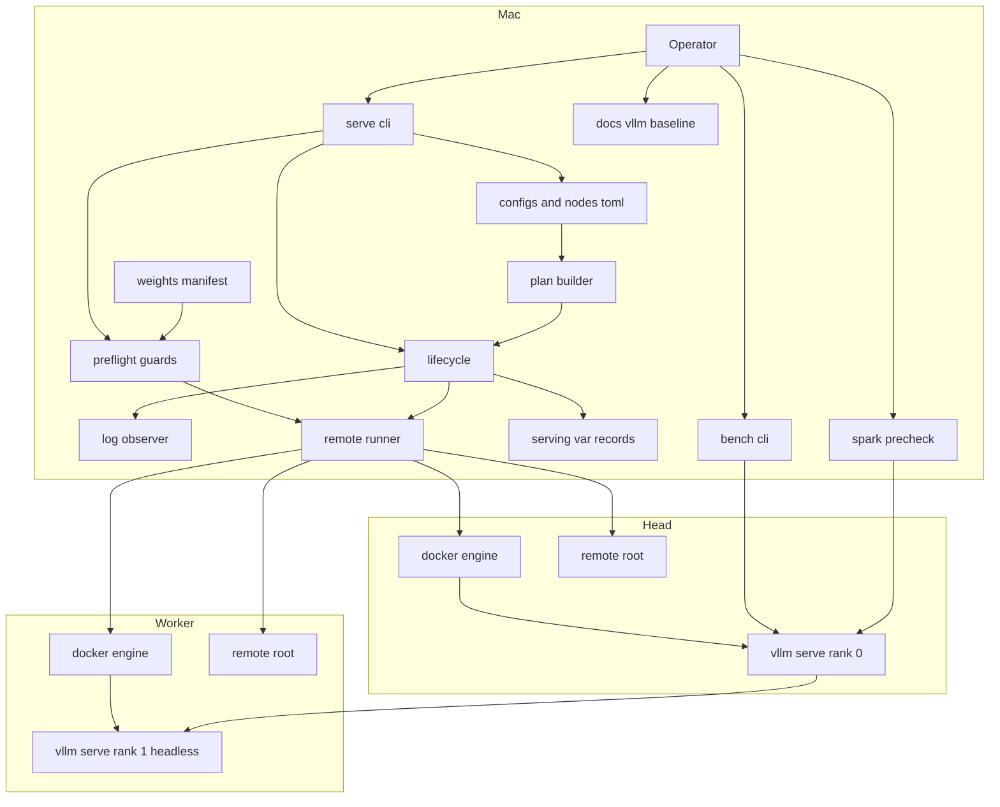
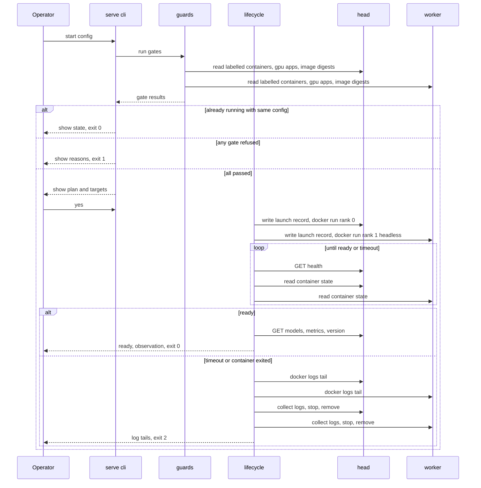
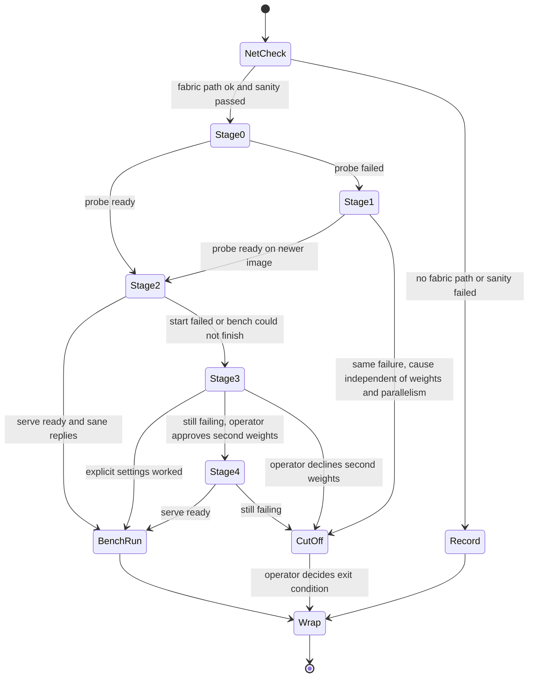

# Design Document: vllm-baseline

## Overview

**Purpose**: 上流の公式の vLLM イメージ (パッチなし) と MIT の約 4 ビットの重みで、DGX Spark 2 台に TP=2 の推論サーバーを立てるための道具 (Serving Kit) と、確かめの手順と記録 (Baseline Procedure) を作る。P0 の `bench` を一通り流せる最初の対象サーバーを得るか、パッチなしでは届かないことを、止まった場所と要る最小の変更とともに示す。

**Users**: このリポジトリの計測者 (開発者)。作業用の Mac から、配布、イメージと重みの取得、起動、状態の確認、停止、記録の回収、通信の確認、1 台の縮小の確認を、同じコマンドでやり直す。

**Impact**: リポジトリに `serving/` (Python の CLI) と `docs/vllm-baseline/` (手順と記録) が加わる。P0 の成果物への変更は、`bench/config/targets.toml` への 1 件の追加と、`LICENSES.md` への行の追加だけ。PLAN.md のハードウェアの記述と、CLAUDE.md の「どこで何をするか」の表を、実態に合わせて直す。

調査の結論 (research.md) は、「現行の上流の vLLM は、パッチなしでは GB10 で起動しない見込みが高い (`pe_dim == 64` の assert)」である。設計は、この結論がどちらに転んでも成り立つようにする。重みを取得する前に、1 台の縮小の確認で数分で判定し、だめなら 184 GiB を落とさずに打ち切りの判断に進む (要件 8.7)。

### Goals

- Mac から 1 つの CLI (`serve`) で、2 台の Spark の推論サーバーを、構成の名前を指定して起こし、確かめ、止められる
- 構成の設定の 1 つ 1 つに根拠があることを、起動の前に機械が検査する。根拠のない設定は、読み込みの時点で断る
- この道具が起こしたコンテナだけを触ることを、ラベルでの選択という構造で保証する
- いちばんの懸念 (アテンションの部品が、このモデルの形を受け付けるか) に、重みの取得の前に当たる
- 通信の確認、`bench` の実行、`/v1/messages` の確認、動かなかった箇所の一覧、判断の記録を、決まった書式で残す
- Spark なしで、Mac の上で試験できる (組み立てた引数の列と、断る条件を試験で固定する)

### Non-Goals

- vLLM へのパッチ、イメージの自前のビルド、変換層の実装 (要るかどうかの判断と記録まで)
- 重みの形式の比較 (P2)、投機的デコード (P3)、通信と性能の詰め (P5)、自動起動と監視と 72 時間の試験 (P6)
- `bench` の中身の変更。Spark の OS、ドライバ、ネットワークの恒久的な設定の変更
- N 台への一般化、Docker 以外の実行の仕組み、代替の順序を自動で進める状態機械

## Boundary Commitments

### This Spec Owns

- `serving/` の全体: 構成の定義 (`serving/config/`)、重みのマニフェスト (`serving/weights/`)、Spark に配るスクリプト (`serving/payload/`)、CLI (`serve`)
- Spark の上の `remote_root` (既定 `~/vllm-baseline/`) の下のすべて: 配ったスクリプト、取得した重み、JIT のキャッシュ、記録、起動の記録
- ラベル `vllm-baseline.owner=serving-kit` が付いたコンテナ (起動、停止、記録の読み取り)
- `docs/vllm-baseline/` (手順書、動かなかった箇所の一覧、試行の記録) と、`docs/decisions/0002`〜`0005`
- `bench/config/targets.toml` の 1 件 (`vllm-nvfp4-tp2`。第二の重みに進んだ場合は、もう 1 件)、`LICENSES.md` の P1 の行、PLAN.md のハードウェアの表の訂正、brief.md の訂正の注記

### Out of Boundary

- ラベルのないコンテナとプロセス (とくに `exl3-tp2`)。止めない、消さない、`docker inspect` も `docker logs` も向けない。知るのは、`nvidia-smi` が返すプロセスの名前とメモリの量だけ
- `bench/src/`、`bench/tests/`、`scripts/spark-precheck.sh` の中身。呼ぶだけで、変えない
- Spark のホストへのパッケージの導入 (`hf`、MPI など)。要るものは、固定したイメージのコンテナの中で動かす
- 第二の候補の重みのモデルカードの本文。第三者のレシピ、ブログ、フォーラムの起動のスクリプト
- thinking の渡し方を `bench` の設定から切り替える口 (要ると分かれば、`bench-harness` の仕様の変更として起票する)

### Allowed Dependencies

- Mac の側: Python 3.12 以上、uv、pydantic、httpx (いずれも `bench/` と同じ版の系列)、システムの `ssh` と `rsync`、`~/.ssh/config` の `spark-153d` / `spark-5083`
- Spark の側: Docker、NVIDIA Container Toolkit、`nvidia-smi`、`sha256sum`、`df`、`ip`、`ethtool` (いずれも入っているものを読むだけ)。入っていなければ、入れずに記録する
- 外部: Docker Hub の `vllm/vllm-openai` (ダイジェストで固定)、Hugging Face Hub の公開のリポジトリ (匿名、commit の 40 桁で固定)
- `bench` の CLI (`bench run` / `calibrate` / `summarize`) と `scripts/spark-precheck.sh`。依存の向きは Serving Kit → なし。Baseline Procedure が両方を順に呼ぶ。**`serving/` は `bench_harness` を import しない。`bench/` も `serving_kit` を import しない**
- 守る制約: ライセンスは MIT / Apache-2.0 / BSD 系だけ。paramiko (LGPL) と ansible (GPLv3) は使わない

### Revalidation Triggers

- 推論サーバーの待ち受けのアドレス、ポート、名乗るモデルの名前を変えたとき → `bench/config/targets.toml` と `spark-precheck.sh` の引数を確かめ直す
- `--enable-prompt-tokens-details` の有無を変えたとき → `input_tokens` の意味が変わるので、前の計測ランと直接比べない
- イメージのダイジェストを替えたとき → 1 台の縮小の確認 (段 0) からやり直す。起動の記録の読み取りの文字列 (`observe`) を確かめ直す
- ラベルの鍵と値を変えたとき → 古いラベルのコンテナが管理の外に出るので、先に止める
- ノードの定義 (直結のアドレスとインターフェースの名前) を変えたとき → 通信の確認をやり直す
- 構成の定義の書式 (`schema_version`) を変えたとき → すべての構成を検査し直す

## Architecture

### Existing Architecture Analysis

- `bench/` は、src レイアウトの Python のプロジェクト (hatchling、uv、`uv.lock` をコミット)。型は pydantic の `frozen` かつ `extra="forbid"`。設定は TOML を `tomllib` で読み、誤りは 1 つの `ConfigError` に寄せて、項目の名前つきの日本語の文にする。CLI は argparse で、`main(argv) -> int` が例外を終了コードに変える (0 正常 / 1 前提の不足 / 2 失敗 / 130 中断)。進捗と誤りは stderr、後の処理が読む行は stdout
- 試験は、HTTP のモックのライブラリを使わず、標準ライブラリの偽のサーバーを相手にする。`tests/unit/test_<モジュール>.py` と `tests/integration/test_e2e_<流れ>.py`
- 生データは、リポジトリの直下の `/results/` (git の管理の外)。公開する要約は `docs/results/`
- `scripts/spark-precheck.sh` は、読み取りだけの独立した道具。引数は「対象サーバーの URL」と「GPU を使ってよいプロセスの名前の正規表現」。GPU のプロセスが 0 件でも NG にする
- 既存の対象サーバー `candidate-d` が `10.0.1.60:8001` を使っている。中身は参照しない。ポートが重ならないようにする
- CI もタスクの定義のファイルもない。`uv sync` と `uv run` を手で打つ

`serving/` は、この流儀をそのまま延長する。PLAN.md のリポジトリの構成の案は、起動と停止と配布を `scripts/` に置くとしているが、根拠の検査を型で保証するために Python のプロジェクトにした (research.md の Decision 1)。PLAN.md と CLAUDE.md の該当の記述は、この仕様の中で直す。

### Architecture Pattern & Boundary Map



**Architecture Integration**:

- **Selected pattern**: 「純粋な組み立て + 薄い実行」。構成の定義から `docker run` の引数の列を作るところまでを、入出力のない純粋な関数にする。Spark に触るのは `RemoteRunner` の 1 か所だけ。試験は、`RemoteRunner` を偽物に差し替えて、組み立てた引数の列と、呼ばれた順序を検査する
- **1 つの起動の仕組み**: 本番の起動 (`serve`)、1 台の縮小の確認 (`probe`)、通信の確認 (`job`) は、同じ仕組みの変形。違うのは待つ条件だけ (受け付けの開始 / 起動の成否の確定 / スクリプトの終了)。構成の `kind` で切り替える
- **Domain boundaries**: Serving Kit はソフトウェア。Baseline Procedure は手順書と記録で、ソフトウェアにしない。段を進める判断には、計測者への確認が挟まる (要件 8.5 / 8.8 / 8.9) ので、自動化しない
- **Existing patterns preserved**: `bench/` の型の流儀、誤りの出し方、終了コード、CLI の作り、試験の名前の規則、`uv.lock` のコミット
- **Dependency direction** (左だけを import する。逆向きは誤りとして扱う):
  `types → config → remote → plan, observe → guards → image, weights, logs → lifecycle → probe, netcheck, watch, thinking → cli`

### Technology Stack

| Layer | Choice / Version | Role in Feature | Notes |
|-------|------------------|-----------------|-------|
| CLI | Python 3.12+、argparse | `serve` コマンド | `bench` と同じ。typer / click は足さない |
| 型と検査 | pydantic 2 系 (`bench/uv.lock` と同じ系列) | 構成の定義、根拠の必須化、記録の型 | `frozen` + `extra="forbid"` |
| 設定 | TOML (`tomllib`) | 構成の定義、ノードの定義 | 継承の仕組みは作らない |
| HTTP | httpx (同上) | `/health`、`/v1/models`、`/metrics`、`/version`、thinking の確かめ、Hub の `tree` API | 新しい依存ではない |
| 遠隔の実行 | システムの `ssh` / `rsync` を `subprocess` で | Spark の上のコマンドの実行、配布、回収 | 引数はリスト。`BatchMode=yes`、`ConnectTimeout=5` |
| コンテナ | Docker + NVIDIA Container Toolkit (Spark に入っているもの) | 推論サーバー、確認のジョブ、重みの取得 | ラベルで自分のものを選ぶ |
| イメージ | `vllm/vllm-openai@sha256:b0501f99…` (`glm53-flash-arm64-cu130`、commit `385dce36…`)。段 1 用に `nightly-aarch64` をダイジェストで固定 | 推論サーバー、torchrun、`hf` | Apache-2.0。ベースの CUDA のイメージの表記は、取得のときに読んで `LICENSES.md` に書く |
| 重み | `RedHatAI/GLM-5.3-Flash-NVFP4` @ `18d55bfd…` (184.3 GiB、MIT) | 第一の候補 | 第二の候補は `canada-quant/GLM-5.3-Flash-W4A16-MTP` @ `f0870306…`。進む前に確認 (要件 8.8) |
| 開発 | pytest、ruff、mypy strict | 試験、整形、型の検査 | `bench/pyproject.toml` の設定を写す |

## File Structure Plan

### Directory Structure

```
serving/
├── pyproject.toml                 # bench と同じ形。name = "serving-kit"、scripts: serve = "serving_kit.cli:main"
├── uv.lock
├── README.md                      # 使い方、終了コード、Spark の上の置き場所、了承の流れ
├── config/
│   ├── configs.toml               # 構成の定義。設定 1 つごとに value / why / 根拠
│   └── nodes.toml                 # head と worker の定義。直結の側の値は実測の根拠つき
├── weights/
│   └── RedHatAI__GLM-5.3-Flash-NVFP4.manifest.json   # 名前、大きさ、sha256。Mac で作ってコミットする
├── payload/                       # Spark に配るもの (これだけを rsync する)
│   ├── allreduce_bench.py         # torchrun で動かす、自前の all-reduce の帯域の計測
│   └── vllm_sanity_check.py       # vLLM のトラブルシュートの文書の確認のスクリプト (出典と commit を先頭に書く)
├── src/serving_kit/
│   ├── __init__.py
│   ├── py.typed
│   ├── types.py                   # すべての型。ほかの serving_kit を import しない
│   ├── config.py                  # TOML の読み込み、根拠の検査、ConfigError
│   ├── remote.py                  # RemoteRunner (ssh / rsync)。Spark に触る唯一の場所
│   ├── plan.py                    # 構成 + ノード → docker の引数の列 (純粋な関数)
│   ├── observe.py                 # 起動の記録と NCCL の記録からの読み取り (純粋な関数)
│   ├── guards.py                  # 起動の前の関門。結果は GateResult の列
│   ├── image.py                   # イメージの取得、識別子の照合、ライセンスの表記の読み取り
│   ├── weights.py                 # マニフェストの生成 (Mac)、取得と照合 (Spark)
│   ├── logs.py                    # 記録の回収、serving/var/ の下の置き場所の決定
│   ├── lifecycle.py               # start / wait / status / stop、起動の記録、片付け
│   ├── probe.py                   # 1 台の縮小の確認
│   ├── netcheck.py                # インターフェースの読み取り、帯域、事前の確認、A/B
│   ├── watch.py                   # 連続の負荷の間の見張り
│   ├── thinking.py                # thinking の深さの 5 通りの送り分け
│   └── cli.py                     # argparse、サブコマンド、終了コードへの変換
├── tests/
│   ├── conftest.py
│   ├── fake_runner.py             # RemoteRunner の偽物。呼ばれた引数の列を記録し、台本どおりに返す
│   ├── fake_vllm.py               # /health、/v1/models、/metrics、/version、/v1/messages に応える偽のサーバー
│   ├── unit/test_<モジュール>.py
│   └── integration/test_e2e_<流れ>.py
└── var/                           # 記録の置き場所 (git の管理の外)

docs/
├── vllm-baseline/
│   ├── procedure.md               # 段 0〜5 の手順、進む条件、止める条件、記録の書式
│   ├── not-working.md             # 動かなかった箇所の一覧
│   └── attempts.md                # 試した構成の記録 (1 行 1 試行)
├── decisions/
│   ├── 0002-vllm-baseline-image-and-weights.md   # イメージと重みの選定、参照した資料の一覧
│   ├── 0003-vllm-baseline-interconnect.md        # 通信の設定の採否、PLAN.md の訂正の根拠
│   ├── 0004-vllm-baseline-messages-api.md        # /v1/messages の対応の状況と、不足の扱い
│   └── 0005-vllm-baseline-exit-condition.md      # 終わりの条件を改めたかどうか、まとめ
└── results/                       # 実測の要約 (根拠の `measured` が指す先)。計測者の指示があったときだけ書く
```

Spark の上 (`remote_root` = `~/vllm-baseline/`。2 台とも同じ形):

```
payload/        # Mac の serving/payload/ の写し
models/<slug>/  # 取得した重み (コンテナには読み取り専用で見せる)
probe/<slug>/   # 縮小の確認に使う、設定とトークナイザだけ
cache/          # JIT のキャッシュ (コンテナの /root/.cache)
logs/           # NCCL の記録、ジョブの出力
state/          # 起動の記録 (<構成>.launch.json)
```

### Modified Files

- `.gitignore` — `serving/.venv/`、`serving/var/`、`serving/.pytest_cache/`、`serving/.mypy_cache/`、`serving/.ruff_cache/`、`serving/**/__pycache__/` を足す
- `bench/config/targets.toml` — `[targets.vllm-nvfp4-tp2]` を足す (`base_url = "http://10.0.1.60:8000"`、`model = "glm-5-3-flash"`)。コードは変えない
- `LICENSES.md` — `serving/` の依存、イメージ、重み、配るスクリプトの出典の行を足す。除いたもの (ansible、paramiko、NGC のコンテナ) と理由も書く
- `PLAN.md` — ハードウェアの表の「直結リンク」の行と、P1 の「直結リンク 2 本を `NCCL_IB_HCA` に並べる」を、実測に合わせて直す。リポジトリの構成の案に `serving/` を足す
- `CLAUDE.md` — 「どこで何をするか」の表の `scripts/` の行を、`serving/` に合わせて直す
- `.kiro/specs/vllm-baseline/brief.md` — 末尾に訂正の注記 (NVFP4 は 1 台あたり約 92 GiB。KV よりも KDA の状態が効く)

## System Flows

### 起動 (`serve start <構成>`)



- 関門は、Spark の状態を変えない読み取りだけ。すべて通ってから、計画を見せて了承を待つ
- 2 台は続けて起こし、順序を制御しない (公式の文書は順序を定めていない)。止めるときだけ head → worker の順にする。`docker stop -t 90` で、`--shutdown-timeout 60` の drain を待たせる
- 待っている間にどちらかのコンテナが終了したら、時間切れを待たずに失敗にする
- 失敗のときは、記録を回収してから片付ける (記録が消えないように、`docker rm` は回収のあと)

### 代替の順序 (Baseline Procedure、要件 8)



- 段 0 は、通信の確認と独立している (1 台だけで済む)。手順書では、安い順に、段 0 を先に流してよいとする。図の矢印は、2 台での起動 (段 2) の前に両方が済んでいることを表す
- 段 2 に進むときに、初めて重み (184.3 GiB × 2 台) を取得する
- 段を移るたびに、`attempts.md` に 1 行を足す。同じ構成を、設定を変えずにもう一度試さない (要件 8.3)。手順書に、試す前に `attempts.md` を見る、という手順を置く
- 2 台での層の分割 (PP=2) は、この図に入らない。`BenchRun` のあと、測るか持ち越すかを計測者に尋ねる (要件 8.9)

## Requirements Traceability

| Requirement | Summary | Components | Interfaces / 成果物 | Flows |
|---|---|---|---|---|
| 1.1 | 要るものだけを配る | remote、cli | `serve push`。`serving/payload/` だけを `remote_root/payload/` に rsync | — |
| 1.2 | Spark の上で編集しない | remote | rsync は `--delete` つきで、Mac の側が正。Spark の上に書くのは、記録と取得した重みだけ | — |
| 1.3 | 構成の名前で 2 台を起動 | plan、lifecycle | `serve start <構成>` | 起動 |
| 1.4 | 受け付けの開始まで待つ | lifecycle | `wait_ready`。`/health` が 200 → `/v1/models` の名前の一致 → `/metrics` が読める | 起動 |
| 1.5 | 時間切れなら記録の末尾を見せて片付ける | lifecycle、logs | `docker logs --tail 80` を 2 台ぶん、回収、stop、rm。終了コード 2 | 起動 |
| 1.6 | 状態の確認 | lifecycle | `serve status`。`NodeStatus` の表 | — |
| 1.7 | 停止と、空いたことの確認 | lifecycle | `serve stop`。GPU のプロセスが 0 件になるまで待って示す | — |
| 1.8 | 同じ状態への再度の指示 | lifecycle | 起動済みなら状態を示して 0。停止済みなら「止まっている」と示して 0 | 起動 |
| 1.9 | 記録の回収 | logs | `serve logs`。`serving/var/<UTC>-logs-<構成>/` へ | — |
| 2.1 | 状態を変える前の了承 | guards、cli | `Confirmer`。計画と対象の機械を見せて `yes` を待つ | 起動 |
| 2.2 | よそのプロセスが GPU を使っていたら断る | guards | `gate_gpu_idle` | 起動 |
| 2.3 | 自分のもの以外を触らない | lifecycle、remote | コンテナの選択は `--filter label=` だけ | — |
| 2.4 | 別の構成の中身を読まない | guards、lifecycle | ラベルのないコンテナに、inspect も logs も向けない。試験で固定 | — |
| 2.5 | ディスクの空きの確認 | guards | `gate_disk_space`。要る量はマニフェストとイメージの大きさから | — |
| 2.6 | 認証の情報を Spark に置かない | weights、plan | 環境変数の許可の一覧。`HF_TOKEN` などを渡さないことを試験で固定 | — |
| 2.7 | 恒久的な設定を変えない | remote、procedure | ホストにパッケージを入れない。`sudo` を呼ばない (試験で固定) | — |
| 2.8 | 恒久的な変更が要るとわかったら判断を仰ぐ | procedure | `not-working.md` に記録して止まる | — |
| 3.1 | 名前の付いた構成を複数持つ | types、config | `configs.toml` の `[configs.<名前>]` | — |
| 3.2 | イメージを固定し、起動のときに照合 | image、guards | `gate_image_digest`。`RepoDigests` に含まれるか。`--pull never` | 起動 |
| 3.3 | 合わなければ断る | guards | 食い違いを示して終了コード 1 | 起動 |
| 3.4 | 重みを入手先、版、検査の値で固定 | weights、types | `WeightsRef` + マニフェスト | — |
| 3.5 | 2 台で照合し、合わないファイルを示す | weights、guards | `serve fetch` の終わりと、`gate_weights_verified` | — |
| 3.6 | 設定ごとの根拠 | types、config | `Setting` の `source` + `quote`、または `measured` | — |
| 3.7 | 根拠のない設定があれば断る | config | 読み込みの時点で `ConfigError`。項目の名前を並べる | — |
| 3.8 | `LICENSES.md` への記録 | image、procedure | `serve image-licenses` の出力を見て、行を足す | — |
| 3.9 | ライセンスが合わないものを除く | procedure | ADR 0002 と `LICENSES.md` に、除いた理由 | — |
| 3.10 | 起動の記録を残す | lifecycle | `LaunchRecord` を `state/` に書き、コンテナのラベルにも持たせる | 起動 |
| 4.1 | インターフェースの読み取り | netcheck | `serve netcheck links` | — |
| 4.2 | ケーブルの本数の判断と PLAN.md の訂正 | netcheck、procedure | `LinkReport.cable_count`。PLAN.md を直す | — |
| 4.3 | 最小の設定での帯域と、公表値との比較 | netcheck | `serve netcheck bandwidth`。`allreduce_bench.py` | — |
| 4.4 | 使われた経路と、束ねの確認 | observe、netcheck | `NcclObservation` | — |
| 4.5 | 設定を足すときの A/B | netcheck | `--env KEY=VALUE` と `--repeat 3`。採用の決まりは下記 | — |
| 4.6 | vLLM の公式の事前の確認 | netcheck | `serve netcheck sanity`。`vllm_sanity_check.py` | — |
| 4.7 | 通らなければ 2 台の起動に進まない | procedure、config | 手順書の関門。ノードの直結の値に実測の根拠がなければ、2 台の構成は読み込めない | 代替の順序 |
| 5.1 | 重みの取得の前の、縮小の起動 | probe、plan | `serve probe <構成>`。`kind = "probe"` | 代替の順序 |
| 5.2 | 選ばれた部品などの読み取り | observe | `LaunchObservation` | — |
| 5.3 | 失敗の記録 | observe、procedure | `known_failure` と誤りの文面。`not-working.md` へ | — |
| 5.4 | 短い要求が返り切ること | probe | 1 つ送り、終わりの理由と HTTP の状態だけを記録 | — |
| 5.5 | 縮小の確認そのものができない場合 | probe、procedure | `ProbeOutcome.inconclusive`。記録して段 2 へ | 代替の順序 |
| 6.1 | 2 台で 1 つのサーバー、Mac から呼べる | plan、lifecycle | head が `10.0.1.60:8000` で待ち受ける | 起動 |
| 6.2 | `/` を含まないモデルの名前 | config | `--served-model-name` は 1 つだけ、`/` を含まない (検査) | — |
| 6.3 | 起動の記録からの読み取り | observe | `LaunchObservation` + `NcclObservation` | — |
| 6.4 | KV の大きさと見積もりの比較 | procedure | ADR 0002 に、実測と brief.md の見積もりと理由 | — |
| 6.5 | 英語と日本語の短い要求 | lifecycle | `serve smoke`。応答を画面に出すが、保存しない | — |
| 6.6 | 失敗の記録と次の構成 | procedure | `not-working.md`、`attempts.md` | 代替の順序 |
| 6.7 | 最初は投機的デコードなし | config、lifecycle | 投機の指定を持つ構成を断る。`/metrics` に `vllm:spec_decode_` が出ないことを確かめる | — |
| 7.1 | `bench` の対象サーバーの定義に足す | procedure | `targets.toml` の `vllm-nvfp4-tp2` | — |
| 7.2 | 計測の前の確認 | procedure | `scripts/spark-precheck.sh http://10.0.1.60:8000 '<実測した名前>'` | — |
| 7.3 | 1 トークンあたりの文字数の測り直し | procedure | `bench calibrate` | — |
| 7.4 | 5 つのまとまりを `quick` で | procedure | `bench run` → `bench summarize` | — |
| 7.5 | 止まったまとまりの記録と続行 | procedure | まとまりごとに別のランで流す。`not-working.md` | — |
| 7.6 | 日本語の壊れの疑いの数 | procedure | `bench summarize` の結果から、同時の本数ごとに | — |
| 7.7 | 2 時間の連続の負荷 | watch、procedure | `serve watch --duration 2h` + `bench run` の繰り返し | — |
| 7.8 | 生データは管理の外、要約は指示があったときだけ | logs、procedure | `serving/var/` と `/results/`。`docs/results/` へは明示の指示で | — |
| 7.9 | 終わったら止めるかを尋ねる | procedure | 手順書の最後の問い | — |
| 8.1 | 決めた順序 | procedure、config | 段 0〜4 と構成の名前の対応 (下記) | 代替の順序 |
| 8.2 | 試行の記録 | procedure | `attempts.md` | 代替の順序 |
| 8.3 | 同じ失敗を繰り返さない | procedure | 試す前に `attempts.md` を見る | — |
| 8.4 | 明示の指定で失うものの記録 | procedure、config | 足した設定は `measured` の根拠を持つ。前後の `bench` の値 | — |
| 8.5 | 打ち切りと判断の依頼 | procedure | ADR 0005 の下書きを示して尋ねる | 代替の順序 |
| 8.6 | 勝手にパッチを当てない、ビルドしない | config、plan | イメージはダイジェストの参照だけ。`docker build` を呼ぶ経路がない (試験で固定) | — |
| 8.7 | 縮小の確認が同じ場所で失敗したら打ち切りへ | probe、procedure | 2 つのイメージの `known_failure` が同じ | 代替の順序 |
| 8.8 | 第二の重みの前の確認、カードを開かない | procedure、weights | マニフェストの生成は `tree` API と `config.json` だけを読む。README を取得しない | 代替の順序 |
| 8.9 | PP=2 は比較の候補 | procedure | `BenchRun` のあとの問い | — |
| 9.1 | `/v1/messages` の 8 項目 | procedure、thinking | 7 項目は `bench` のランを根拠に。1 項目は `serve thinking` | — |
| 9.2 | thinking の深さが実際に変わるか | thinking | 5 通りの送り分け | — |
| 9.3 | `bench` で済むものは足さない | procedure | ADR 0004 に、項目ごとの根拠のランの ID | — |
| 9.4 | 不足の扱いの案 | procedure | ADR 0004 | — |
| 9.5 | P0 の判断を見直す理由の記録 | procedure | ADR 0004。`bench` の変更は別の仕様 | — |
| 10.1 | 一覧の 1 件の項目 | procedure | `not-working.md` の書式 (下記) | — |
| 10.2 | `docs/` の下の文書 | procedure | `docs/vllm-baseline/not-working.md` | — |
| 10.3 | 判断の記録 | procedure | ADR 0002〜0005 | — |
| 10.4 | 再現の事実と、報告するかの問い | procedure | 一覧の「上流」の欄 | — |
| 10.5 | 本文、認証の情報、別の構成の中身を含めない | thinking、probe、logs、procedure | 確かめの道具は、長さと数だけを記録する。記録の回収は自分のコンテナだけ | — |
| 10.6 | 終わりのまとめ | procedure | ADR 0005 | — |
| 11.1 | 使う資料の範囲 | procedure | ADR 0002 の「参照した資料」 | — |
| 11.2 | 事実だけを使い、コマンドを写さない | config | 根拠の `source` は、道具の一次の資料を指す | — |
| 11.3 | 第三者のレシピを開かない | procedure、weights | 8.8 と同じ | — |
| 11.4 | 文脈を切り離した作業者 | procedure | 構成の値を書く実装のタスクは、新しいサブエージェントに、research.md と公式の資料だけを渡す | — |
| 11.5 | 根拠に辿れない設定の差し戻し | config、procedure | 機械の検査 (3.7) + レビューの項目 | — |
| 11.6 | 参照した資料の一覧 | procedure | ADR 0002 | — |

## Components and Interfaces

| Component | Layer | Intent | Req Coverage | Key Dependencies | Contracts |
|---|---|---|---|---|---|
| types | 型 | すべての型 | 3.1, 3.4, 3.6 | pydantic (P0) | State |
| config | 設定 | TOML の読み込みと、根拠などの検査 | 3.1, 3.6, 3.7, 6.2, 6.7, 11.5 | types (P0) | Service |
| remote | 遠隔 | ssh / rsync の実行 | 1.1, 1.2, 2.3, 2.7 | システムの ssh、rsync (P0) | Service |
| plan | 組み立て | 構成 → docker の引数の列 | 1.3, 2.6, 6.1, 8.6 | types (P0) | Service |
| observe | 読み取り | 記録からの事実の抜き出し | 4.4, 5.2, 5.3, 6.3 | types (P0) | Service |
| guards | 関門 | 起動の前の検査と、了承 | 2.1, 2.2, 2.5, 3.2, 3.3, 3.5 | remote (P0)、types のマニフェストの型 (P0) | Service |
| image | イメージ | 取得、照合、ライセンスの表記の読み取り | 3.2, 3.8 | remote (P0) | Service |
| weights | 重み | マニフェスト、取得、照合 | 3.4, 3.5, 2.6, 8.8 | remote (P0)、httpx (P0) | Service、Batch |
| logs | 記録 | 回収と置き場所 | 1.9, 7.8, 10.5 | remote (P0) | Service |
| lifecycle | 運転 | start / wait / status / stop / smoke | 1.3〜1.8, 3.10, 6.5, 6.7 | plan、guards、observe、logs (P0) | Service、State |
| probe | 確認 | 1 台の縮小の確認 | 5.1〜5.5, 8.7 | lifecycle (P0) | Batch |
| netcheck | 確認 | 通信の確認 | 4.1〜4.6 | lifecycle、observe (P0) | Batch |
| watch | 確認 | 連続の負荷の間の見張り | 7.7 | remote、httpx (P0) | Batch |
| thinking | 確認 | thinking の深さの確かめ | 9.2, 10.5 | httpx (P0) | Batch |
| cli | 入口 | サブコマンドと終了コード | すべてのコマンド | 上のすべて | — |
| procedure (文書) | 手順 | 段の順序、記録の書式、判断の記録 | 2.8, 4.7, 6.4, 6.6, 7.x, 8.x, 9.x, 10.x, 11.x | serve、bench、spark-precheck | — |

### 型と設定

#### types / config

| Field | Detail |
|-------|--------|
| Intent | 構成の定義を型にし、根拠のない設定を、読み込みの時点で断る |
| Requirements | 3.1, 3.4, 3.6, 3.7, 6.2, 6.7, 11.2, 11.5 |

**Responsibilities & Constraints**

- すべての型は `frozen` かつ `extra="forbid"`。知らない項目は、綴りの誤りとして断る
- 1 つの設定 (`Setting`) は、`flag`、`value`、`why`、根拠を持つ。根拠は、`source` + `quote` の組か、`measured` のどちらか一方だけ
- `measured` は、リポジトリの `docs/` の下の、実在するファイルへの相対のパス。ファイルがなければ断る。これで、「あとで測る」という値のない設定が、構成に紛れ込まない
- 同じフラグを 2 度書けるように (`--ulimit`、`--mount`)、TOML の鍵はフラグではなく、設定の識別子にする

```python
class Provenance(_Frozen):
    source: HttpUrl | None = None      # 公式の資料の URL
    quote: str | None = None           # その原文の抜粋 (source と組)
    measured: str | None = None        # docs/ の下の、実測の記録へのパス

class Setting(Provenance):
    flag: str                          # "--ipc" / "--tensor-parallel-size" / 環境変数の名前
    value: str | None = None           # None は、値のないフラグ
    why: str = Field(min_length=1)
    only_on: NodeRole | None = None    # head か worker だけに付ける設定

class ImageRef(Provenance):
    ref: str                           # "vllm/vllm-openai@sha256:<64 桁>" だけを受ける
    seen_as: str                       # 人が読むためのタグ
    size_bytes: PositiveInt            # ディスクの空きの検査に使う

class WeightsRef(Provenance):
    repo: str
    revision: str                      # 40 桁の commit
    manifest: str                      # serving/weights/ の下のファイル
    mount_at: str

class ConfigDef(_Frozen):
    name: str                          # TOML の鍵から入れる
    kind: Literal["serve", "probe", "job"]
    description: str
    nodes: tuple[NodeRole, ...]        # serve は head と worker。probe は 1 つ
    image: ImageRef
    weights: WeightsRef | None         # job だけ None でよい。probe は、設定とトークナイザの取得元として持つ
    docker: dict[str, Setting]
    serve: dict[str, Setting]          # job では、コンテナの中で動かすコマンドの引数
    env: dict[str, Setting]
    ready_timeout_s: PositiveInt
    served_model_name: str             # serve と probe で必須

class NodeDef(_Frozen):
    role: NodeRole                     # "head" | "worker"
    ssh_host: str                      # "spark-153d"
    lan_addr: IPv4Address              # 10.0.1.60
    remote_root: str                   # "/home/j5ik2o/vllm-baseline"
    fabric_addr: IPv4Address | None    # 直結の側。実測で埋める
    fabric_ifname: str | None
    fabric_measured: str | None        # 上の 2 つの根拠 (docs/results/ の下)
```

##### Service Interface

```python
def load_configs(path: Path, repo_root: Path) -> dict[str, ConfigDef]: ...
def load_nodes(path: Path, repo_root: Path) -> dict[NodeRole, NodeDef]: ...
def select_config(configs: dict[str, ConfigDef], name: str,
                  nodes: dict[NodeRole, NodeDef]) -> ConfigDef: ...   # なければ、使える名前を添えて ConfigError。検査 7 もここで
```

- 検査 (いずれも `ConfigError`。項目の名前を、`configs.p1-nvfp4-tp2.serve.max-num-seqs: 根拠がない` の形で、すべて並べる):
  1. 根拠: `source` と `quote` の両方がある、または `measured` がある。両方ある、どちらもない、`measured` のファイルがない、は誤り
  2. イメージ: `ref` が `<名前>@sha256:<64 桁の 16 進>` の形。タグだけの参照は誤り
  3. 重み: `revision` が 40 桁の 16 進。マニフェストのファイルがある
  4. モデルの名前: `--served-model-name` が 1 つだけで、`/` を含まない (6.2)
  5. 投機的デコード: `--speculative-config`、`--spec-method`、`--spec-model`、`--spec-tokens` のどれかを持つ構成は誤り (6.7。P3 で、この検査を構成ごとの許可に変える)
  6. 置き換えの印: 値に書けるのは、`{node.fabric_addr}`、`{node.fabric_ifname}`、`{node.rank}`、`{head.fabric_addr}`、`{head.lan_addr}`、`{weights.mount_at}`、`{remote_root}` だけ。ほかの `{…}` は誤り
  7. 直結の値: `kind` が `serve` か `job` で、ノードが 2 つの構成は、2 台の `fabric_addr`、`fabric_ifname`、`fabric_measured` が揃っていなければ誤り (4.7)。**この検査だけは、読み込みのときではなく、構成を選んだとき (`select_config`) に、選んだ構成について行う**。直結の値を埋める前でも、1 台の構成 (`probe-pinned`) と `serve netcheck links` は使えるようにするため
  8. 禁じる docker のフラグ: `--privileged`、`--restart` の `no` 以外、`--rm` (記録が消える) は誤り

**Implementation Notes**

- 構成の値そのもの (どのフラグに、どの値と、どの出典を書くか) は、research.md の §a〜§g から引く。値を書くタスクは、要件 11.4 に従って、新しいサブエージェントに、research.md と公式の資料だけを渡して行わせる
- research.md の構成のスケッチは、TOML の鍵をフラグの名前にしていた。同じフラグを 2 度書けないので、鍵を識別子に変え、`flag` の項目を足した

### 遠隔の実行

#### remote

| Field | Detail |
|-------|--------|
| Intent | Spark に触る、ただ 1 つの場所 |
| Requirements | 1.1, 1.2, 2.3, 2.7 |

```python
class CommandResult(_Frozen):
    argv: tuple[str, ...]
    exit_code: int
    stdout: str
    stderr: str
    duration_s: float

class RemoteRunner(Protocol):
    def run(self, node: NodeDef, argv: Sequence[str], *, timeout_s: float,
            mutating: bool) -> CommandResult: ...
    def push(self, node: NodeDef, local_dir: Path, remote_subdir: str, *,
             delete: bool) -> CommandResult: ...
    def pull(self, node: NodeDef, remote_path: str, local_dir: Path) -> CommandResult: ...
```

- Spark の上のファイルに書く道は、`push` だけ (コンテナが自分で書く記録と、取得した重みを除く)。起動の記録と、照合の結果の記録は、Mac で作った小さなファイルを `state/` に `push(delete=False)` で置く。`payload/` は `push(delete=True)` で、Mac の側と同じにする
- `ApprovedPlan` (了承を得た計画。状態を変える呼び出しの引数の列の一覧) の型は `types` に置く。`guards` が作り、`SshRunner` が受け取る

- 実装は `SshRunner` の 1 つだけ。`ssh -o BatchMode=yes -o ConnectTimeout=5 <ssh_host> -- <shlex.join(argv)>`。遠隔のシェルに渡る文字列は、必ず `shlex.join` で作る (引用の事故を防ぐ)
- `mutating=True` の呼び出しは、その前に了承を得た計画に含まれていなければ、`RuntimeError` にする (`ApprovedPlan` を渡して作る)。了承なしに状態を変える経路を、構造でなくす (2.1)
- `argv[0]` の許可の一覧: `docker`、`nvidia-smi`、`df`、`sha256sum`、`ip`、`ethtool`、`ibv_devinfo`、`ibdev2netdev`、`cat`、`mkdir`、`test`、`uname`。`sudo`、`apt`、`pip`、`systemctl` は、一覧にないので呼べない (2.7)
- `push` は `rsync -a` (`delete=True` のときは `--delete` つき)。宛先は `remote_root` の下だけ。`pull` は `serving/var/` の下だけ
- 時間切れ、接続の失敗は、`RemoteError` (どのノードの、どのコマンドかを持つ)

### 組み立てと読み取り

#### plan

| Field | Detail |
|-------|--------|
| Intent | 構成とノードから、`docker run` の引数の列を作る (入出力のない関数) |
| Requirements | 1.3, 2.6, 3.10, 6.1, 8.6 |

```python
class ContainerPlan(_Frozen):
    node: NodeRole
    container_name: str                # "vb-<構成>-<役割>"。英数字とハイフンだけ
    labels: dict[str, str]
    argv: tuple[str, ...]              # ["docker", "run", "-d", "--pull", "never", ...]

def build_plans(config: ConfigDef, nodes: dict[NodeRole, NodeDef],
                started_at: datetime) -> tuple[ContainerPlan, ...]: ...
```

- 道具が必ず付けるもの (構成に書かない。構成に書いてあれば誤り): `-d`、`--pull never`、`--name`、`--label`、`--restart no`。根拠は、`plan.py` の中の定数に、構成と同じ `Provenance` の形で持つ (試験で、空でないことを確かめる)
- ラベル: `vllm-baseline.owner=serving-kit`、`vllm-baseline.config=<名前>`、`vllm-baseline.kind=<kind>`、`vllm-baseline.role=<役割>`、`vllm-baseline.image=<ダイジェスト>`、`vllm-baseline.weights=<repo>@<revision>`、`vllm-baseline.started-at=<UTC>`。`serve status` は、このラベルから「どの構成で動いているか」を読む (1.6)
- 環境変数は、構成の `env` にあるものだけを `-e` で渡す。Mac の側の環境を引き継がない。名前に `TOKEN`、`KEY`、`SECRET`、`PASSWORD` を含むものは誤り (2.6)
- `only_on` で、head と worker の差 (`--node-rank`、`--headless`、`VLLM_HOST_IP`) を表す。差は、この 3 つと、置き換えの印だけ
- 引数の順序は決まっている (docker の引数 → イメージの参照 → serve の引数)。試験で、構成から作った列を、そのまま固定する

#### observe

| Field | Detail |
|-------|--------|
| Intent | 起動の記録と NCCL の記録から、事実を抜き出す (入出力のない関数) |
| Requirements | 4.4, 5.2, 5.3, 6.3 |

```python
class LaunchObservation(_Frozen):
    vllm_version: str | None
    attention_backend: str | None
    attention_candidates: tuple[str, ...]
    moe_backend: str | None
    kv_cache_tokens: int | None
    kv_cache_gib: float | None
    max_concurrency_note: str | None
    model_loading_gib: float | None
    model_loading_s: float | None
    engine_init_s: float | None
    speculative_config_seen: bool
    known_failure: KnownFailure | None     # 下の表
    failure_excerpt: tuple[str, ...]       # 誤りの前後の行 (最大 40 行)

class NcclObservation(_Frozen):
    nccl_version: str | None
    network: Literal["IB", "Socket"] | None
    ib_no_device: bool
    ib_devices_line: str | None
    merged_nic: bool                       # "TOPO/NET : Made vNic" か、ndevs>=2
    coll_channels: int | None
    gdrdma_seen: bool                      # Spark では False が正常
    socket_channel_seen: bool

def observe_launch(log_text: str) -> LaunchObservation: ...
def observe_nccl(log_text: str) -> NcclObservation: ...
```

| `KnownFailure` | 探す文字列 | 対応しそうな上流 |
|---|---|---|
| `pe_dim_assert` | `pe_dim must be 64` | #57578、#55773 (直す候補: #55277、#53969、#55778) |
| `no_attention_backend` | `No valid attention backend found` | 同上 |
| `no_kernel_image` | `no kernel image is available for execution on the device` | sm_121 がビルドの対象にない |
| `kpool_block_size` | `kpool indexer requires cache block_size` | `--block-size 256` の明示 |
| `startup_memory_check` | `is less than desired GPU memory utilization` | `--gpu-memory-utilization` を下げる |
| `deep_gemm_missing` | `requires DeepGEMM to be installed` | — |
| `unclassified` | (上のどれでもない終了) | 一覧に、誤りの文面をそのまま |

- 読めなかった項目は `None` のまま返す (断らない)。文字列は vLLM の版で変わりうるので、イメージを替えたら確かめ直す (Revalidation Triggers)
- KV キャッシュの型 (6.3) が、どの行に出るかは、実機の記録を見て決める。読めるようになるまでは、`failure_excerpt` と同じ扱いで、該当しそうな行を手順書の側で記録する

### 関門

#### guards

| Field | Detail |
|-------|--------|
| Intent | 状態を変える前に、読み取りだけで、進めてよいかを判定する |
| Requirements | 2.1, 2.2, 2.4, 2.5, 3.2, 3.3, 3.5 |

```python
class GateResult(_Frozen):
    gate: str
    node: NodeRole | None
    passed: bool
    detail: str                        # 断るときは、見つけたものと、要る量と空いている量

class Confirmer(Protocol):
    def confirm(self, plan_text: str) -> bool: ...
```

| 関門 | 読むもの | 断る条件 |
|---|---|---|
| `gate_reachable` | `uname -n` | ssh で入れない |
| `gate_own_state` | `docker ps -a --filter label=vllm-baseline.owner=serving-kit --format json` | 別の構成の、自分のコンテナが動いている (先に `serve stop`) |
| `gate_gpu_idle` | `nvidia-smi --query-compute-apps=pid,process_name,used_memory --format=csv,noheader` | 自分のコンテナが 1 つも動いていないのに、GPU のプロセスがある。名前とメモリの量を示す (2.2) |
| `gate_image_digest` | `docker image inspect --format '{{json .RepoDigests}}' <ref>` | 一覧に、構成のダイジェストがない (3.3) |
| `gate_weights_verified` | `state/<slug>.verified.json` (照合の結果の記録) と、`models/<slug>/` の一覧と大きさ | 照合の記録がない、マニフェストの版と違う、ファイルの一覧か大きさが合わない (3.5) |
| `gate_disk_space` | `df -B1 --output=avail <remote_root>` | 空きが、要る量 (マニフェストの合計、またはイメージの大きさ) + 10% に足りない (2.5) |

- 関門は、ラベルのないコンテナに、`docker inspect` も `docker logs` も `docker top` も向けない。よそのものについて知るのは、`nvidia-smi` の 3 つの列だけ (2.4)
- `kind = "probe"` の構成では、`gate_weights_verified` と `gate_disk_space` は、マニフェストのうち、設定とトークナイザのファイル (safetensors を除いたもの) だけを対象にする。置き場所は `probe/<slug>/`
- `gate_weights_verified` は、起動のたびに 184 GiB の sha256 を計算し直さない。全体の照合は `serve fetch` の終わりと `serve verify` で行い、結果を記録する。起動のときは、その記録と、一覧と大きさを見る
- `Confirmer` の実装は 2 つ。端末で `yes` の入力を待つもの。`--yes` が付いたときに、計画を表示してから通すもの。端末でなく、`--yes` もなければ、断って終了コード 1。Claude が計測者の代わりに打つときは、会話の中で了承を得てから `--yes` を付ける (README に書く)

### イメージと重み

#### image

| Field | Detail |
|-------|--------|
| Intent | イメージを、ダイジェストで取得し、照合し、中のライセンスの表記を読む |
| Requirements | 3.2, 3.8, 2.1, 2.5 |

- `serve pull-image <構成>`: 関門 (`gate_reachable`、`gate_disk_space`) → 了承 → 2 台で `docker pull <ref>` → `gate_image_digest` で確かめる
- `serve image-licenses <構成>`: `docker run --rm --label … --entrypoint cat <ref> <path>` で、ライセンスの表記の候補のファイルを読んで表示する。ここだけは `--rm` を使う (終わるとすぐ消える読み取りのコンテナ)。どのファイルを読むかは、取得のあとに中を見て決める。`LICENSES.md` に書くのは人

#### weights

| Field | Detail |
|-------|--------|
| Intent | 重みを、版とファイルごとの検査の値で固定し、2 台で照合する |
| Requirements | 3.4, 3.5, 2.6, 8.8, 11.3 |

##### Batch / Job Contract

| コマンド | Trigger | すること | Idempotency |
|---|---|---|---|
| `serve manifest <repo> <revision>` | Mac で、構成を足すとき | Hub の `GET /api/models/{repo}/tree/{revision}?recursive=1` (匿名) から、名前、大きさ、LFS の sha256 を取る。LFS でない小さなファイルは、Mac に取得して sha256 を計算する。`README.md` と `.gitattributes` は、取得も記載もしない | 同じ版なら、同じファイルができる |
| `serve fetch <構成>` | 段 2 に進むとき | 関門 (空き) → 了承 → 2 台で並行に、固定したイメージのコンテナの中で `hf download <repo> --revision <40 桁> --local-dir /models/<slug> --max-workers 8` (`README.md` を除く) → 照合 | 終わったファイルは残る。もう一度流すと、足りないものだけが対象になる |
| `serve verify <構成>` | 取得のあと、または疑わしいとき | 2 台で `sha256sum` を流し、Mac の側でマニフェストと突き合わせる。結果を `state/<slug>.verified.json` に書く | 読み取りだけ (記録の 1 ファイルを除く) |

- 照合の正解は、Mac でマニフェストとしてコミットしたもの。Spark の側で正解を作らない。`hf cache verify` は使わない (Hub に問い合わせる照合で、固定したマニフェストとの照合にならない)
- 合わないファイルがあれば、名前を並べて終了コード 2。**黙って取り直さない** (`bench` の公開の課題と同じ方針)
- 取得のコンテナに渡す環境変数は、`HF_HUB_DISABLE_TELEMETRY=1` だけ。トークンを渡さない (2.6)
- イメージの中に `hf` がない場合 (実機で確かめる)、ホストに入れずに止まり、計測者に尋ねる。代わりの方法は、Mac に取得して rsync で配る (Mac に 184 GiB の空きが要る)
- 第二の候補の重みのマニフェストを作るときも、同じ道具を使う。`README.md` (モデルカード) を取得しないことを、試験で固定する (8.8)

### 運転

#### lifecycle

| Field | Detail |
|-------|--------|
| Intent | 起こす、待つ、確かめる、止める。何度やっても同じ結果になる |
| Requirements | 1.3, 1.4, 1.5, 1.6, 1.7, 1.8, 3.10, 6.1, 6.5, 6.7 |

**Contracts**: Service [x] / State [x]

```python
class NodeStatus(_Frozen):
    node: NodeRole
    container_state: Literal["absent", "running", "exited"]
    exit_code: int | None
    config_name: str | None            # ラベルから
    image_digest: str | None           # ラベルから
    started_at: datetime | None
    gpu_apps: tuple[GpuApp, ...]       # 名前とメモリの量
    fabric_link_up: bool | None

class ServiceStatus(_Frozen):
    nodes: tuple[NodeStatus, ...]
    health_ok: bool | None             # head の /health
    served_model: str | None           # /v1/models の data[0].id
    running_requests: int | None       # /metrics
    waiting_requests: int | None

def start(config: ConfigDef, ...) -> StartOutcome: ...     # ready | already_running | refused | failed
def status(...) -> ServiceStatus: ...
def stop(...) -> StopOutcome: ...                          # stopped | already_stopped | gpu_not_released
def smoke(config: ConfigDef, ...) -> SmokeOutcome: ...     # 英語と日本語を 1 つずつ
```

##### State Management

- 状態の出どころは、Docker のラベルつきのコンテナだけ。Mac の側に、状態のファイルを持たない (2 つの出どころが食い違うことをなくす)
- `LaunchRecord` (構成の名前、イメージのダイジェスト、重みの `repo@revision`、開始の時刻、組み立てた引数の列、構成のファイルの sha256) を、起動の直前に `state/<構成>.launch.json` に書く。`serve logs` が、記録と一緒に回収する (3.10)
- 受け付けの開始の判定: (1) head の `/health` が 200、(2) `/v1/models` の `data[0].id` が `served_model_name` と一致、(3) `/metrics` が読めて、`vllm:spec_decode_` で始まる行がない (6.7)。10 秒ごとに見る。上限は構成の `ready_timeout_s` (最初の値は 1800。実測で直す)
- 停止: head に `docker stop -t 90` → worker に同じ → 2 台で `docker rm` → GPU のプロセスが 0 件になるまで、最大 60 秒待つ。空かなければ `gpu_not_released` で、残っているプロセスの名前を示す (止めには行かない)
- `smoke` は、応答の本文を画面に出すが、ファイルには書かない。記録するのは、HTTP の状態、終わりの理由、トークンの数、置き換え文字 (U+FFFD) の有無だけ (10.5)

### 確認

#### probe

| Field | Detail |
|-------|--------|
| Intent | 重みを取得せずに、1 台で、いちばんの懸念に当たる |
| Requirements | 5.1, 5.2, 5.3, 5.4, 5.5, 8.7 |

- `kind = "probe"` の構成を、1 つのノードで起こす。中身は、`--load-format dummy`、層の数を減らす `--hf-overrides`、小さな `--max-model-len` と `--max-num-seqs`、`VLLM_LOGGING_LEVEL=DEBUG`。モデルの場所は、設定とトークナイザだけを置いた `probe/<slug>/` (数十 MiB。`serve fetch --probe-files` で取得)
- 層の減らし方の条件: アテンションの形 (`qk_rope_head_dim`、`kv_lora_rank`、`index_kpool` など) を変えない。線形アテンションの層と、sparse MLA の層と、MoE の層 (`first_k_dense_replace` より後ろ) を、それぞれ 1 つ以上含む。具体の `layer_types` は、実装のタスクで `config.json` から決めて、根拠 (`source` = その `config.json`) を添える
- 結果は 3 つ: `ready` (起動した。短い要求を 1 つ送り、返り切ったかだけを記録)、`failed` (`LaunchObservation.known_failure` つき)、`inconclusive` (縮めた形を受け付けない、など、モデルの懸念とは別の理由。5.5)
- どの結果でも、記録を回収してから、必ず止めて片付ける。確認のコンテナを動かしたままにしない
- 構成は 2 つ用意する: `probe-pinned` (固定したイメージ) と `probe-nightly` (より新しいイメージ。ダイジェストは、段 1 に進むときに、その時点のものを固定する)。2 つの `known_failure` が同じなら、手順書の段 1 → 打ち切りの判定の材料になる (8.7)

#### netcheck

| Field | Detail |
|-------|--------|
| Intent | 2 台の間の通信が、どの経路で、どれだけの速さで通るかを確かめる |
| Requirements | 4.1, 4.2, 4.3, 4.4, 4.5, 4.6 |

| コマンド | すること | 状態を変えるか |
|---|---|---|
| `serve netcheck links` | 2 台で `ip -br link`、`ip -br addr`、`ethtool <if>` (速さ)、あれば `ibv_devinfo` / `ibdev2netdev` を読む。`LinkReport` (インターフェースの名前、状態、MTU、速さ、アドレス、RoCE のデバイスとの対応、ケーブルの本数の判断) を出す | 変えない |
| `serve netcheck bandwidth` | `kind = "job"` の構成で、2 台のコンテナの中で `torchrun --nnodes 2 --nproc-per-node 1 --rdzv_backend static … allreduce_bench.py` を流す。NCCL の記録をファイルに取り、`NcclObservation` と、メッセージの大きさごとの `busbw` を出す | 変える (コンテナを起こす。了承が要る) |
| `serve netcheck sanity` | 同じ形で `vllm_sanity_check.py` を流し、4 段 (PyTorch の NCCL、GLOO、vLLM の NCCL、CUDA グラフの中の NCCL) の成否を出す | 同上 |

- `allreduce_bench.py` の決まり: 集団通信は all-reduce。メッセージは 1 MiB から 1 GiB まで 4 倍ずつ。大きさごとに、温めを 5 回、計測を 20 回。`algbw = S / t`、`busbw = algbw × 2(n−1)/n` (NCCL の公式の Performance の文書の定義。n=2 では係数は 1)。単位は 10 進の GB/s と Gbps。出力は JSON の 1 行
- 比べる相手: NVIDIA の公表の実測 189.85 Gbps (`ib_write_bw`、道具が違うことを記録に書く) と、NVIDIA 自身の合否のしきい値 175 Gbps
- 合否 (4.7): `network == "IB"` かつ `socket_channel_seen` が偽、かつ `sanity` の 4 段がすべて通る。満たさなければ、手順書は 2 台の起動に進まない
- A/B (4.5): `--env KEY=VALUE` (何度でも) と `--repeat 3`。最小の設定と、足した設定を、3 回ずつ交互に流す。**採用するのは、足した側の最小が、最小の設定の側の最大を上回ったときだけ** (大きなメッセージの `busbw` で比べる)。採用したら、結果の要約を `docs/results/` に書き (計測者の指示で)、構成には `measured` の根拠で書く
- 最初の A/B は、`NCCL_SOCKET_IFNAME` を直結の側にするか、管理の側にするか (NVIDIA の 2 つの手順で割れている)
- 最小の設定は、`VLLM_HOST_IP`、`NCCL_SOCKET_IFNAME`、`GLOO_SOCKET_IFNAME` だけ。`NCCL_IB_HCA`、`NCCL_IB_MERGE_NICS`、`NCCL_IB_GID_INDEX` は設定しない。確認のときだけ、`NCCL_DEBUG=INFO`、`NCCL_DEBUG_SUBSYS=INIT,BOOTSTRAP,ENV,NET,GRAPH`、`NCCL_DEBUG_FILE` を足す
- nccl-tests は使わない (2 台で動かすには MPI が要り、Spark への導入は恒久的な変更になる)。計測者が求めたときの追加の確認として、手順書に残す (2.8)

#### watch

| Field | Detail |
|-------|--------|
| Intent | 連続の負荷の間、外から見張って、固まりを時刻つきで残す |
| Requirements | 7.7 |

- `serve watch --duration 2h --interval 30s`。読み取りだけ。何も止めない、起こし直さない
- 1 回の観察: head の `/health` (10 秒で時間切れ)、`/metrics` の `vllm:generation_tokens_total`、`vllm:num_requests_running`、`vllm:num_requests_waiting`、2 台の `nvidia-smi --query-gpu=utilization.gpu --format=csv,noheader`。1 行の JSON にして `serving/var/<UTC>-watch-<構成>/samples.jsonl` に足す
- 判定: `unresponsive` = `/health` が続けて 3 回失敗。`stalled` = 処理中の要求が 1 つ以上あるのに、生成のトークンの数が 5 分続けて増えず、その間、2 台の GPU の使用率が 90% 以上 (#41725 の形)。起きたら、時刻と、その前後の観察を要約に書き、2 台の記録を回収する。見張りは、決めた時間まで続ける
- 負荷は、手順書の側で、`bench run` を 2 時間のあいだ繰り返して流す (どのまとまりを回すかは、`quick` の 1 回の所要を測ってから、手順書に書く)。`bench` は変えない
- GB10 で `utilization.gpu` が読めるかは、実機で確かめる。読めなければ、判定を生成のトークンの数だけで行い、そのことを要約に書く

#### thinking

| Field | Detail |
|-------|--------|
| Intent | thinking の深さの渡し方が、実際に出力を変えるかを確かめる |
| Requirements | 9.2, 10.5 |

- `serve thinking --base-url … --model …`。同じ入力、`temperature 0` で、5 通りを送る: (1) 何も渡さない、(2) `output_config.effort = "low"`、(3) `chat_template_kwargs.reasoning_effort = "low"`、(4) `output_config.effort = "medium"` (効かないはず)、(5) `chat_template_kwargs.clear_thinking = true` (複数ターンの会話で、入力のトークンが減るはず)
- 記録するのは、thinking のブロックの文字数、`input_tokens`、`output_tokens`、終わりの理由だけ。本文は保存しない (10.5)
- 効いたと言える条件: 1 と 2 で、thinking の文字数か `output_tokens` がはっきり変わる。4 は 1 と変わらない。5 は、複数ターンで `input_tokens` が減る。温度 0 でも出力が揺れるという報告 (#54521) があるので、各 3 回ずつ送り、範囲が重ならないことを見る

### 入口

#### cli

| Field | Detail |
|-------|--------|
| Intent | サブコマンドを、下の部品の呼び出しと、終了コードに変える |
| Requirements | 1.1, 1.3, 1.6, 1.7, 1.9, 2.1 |

| コマンド | すること | Spark の状態を変えるか (了承が要るか) |
|---|---|---|
| `serve check <構成>` | 構成の検査と、すべての関門を流して、結果を並べる | 変えない |
| `serve push` | `serving/payload/` を 2 台の `remote_root/payload/` に配る | 変える |
| `serve pull-image <構成>` | イメージを、ダイジェストで 2 台に取得する | 変える |
| `serve image-licenses <構成>` | イメージの中の、ライセンスの表記を読んで表示する | 変える (すぐ消える読み取りのコンテナ) |
| `serve manifest <repo> <revision>` | Mac で、マニフェストを作る | 変えない (Spark に触らない) |
| `serve fetch <構成> [--probe-files]` | 重み (または、設定とトークナイザだけ) を 2 台に取得して照合する | 変える |
| `serve verify <構成>` | 2 台の重みを、マニフェストと照合する | 変える (照合の記録の 1 ファイルだけ) |
| `serve start <構成>` / `stop` / `status` | 起動、停止、状態の確認 | `start` と `stop` は変える。`status` は変えない |
| `serve smoke <構成>` | 英語と日本語の短い要求を 1 つずつ送る | 変えない |
| `serve logs [--since]` | 2 台の記録を `serving/var/` に写す | 変えない |
| `serve probe <構成>` | 1 台の縮小の確認 | 変える |
| `serve netcheck links` / `bandwidth` / `sanity` | 通信の確認 | `links` は変えない。ほかは変える |
| `serve watch` / `serve thinking` | 見張り、thinking の深さの確かめ | 変えない |

- すべてのコマンドに共通: `--configs`、`--nodes` (既定は `serving/config/` の下)、`--yes`。標準出力は、後の処理が読める決まった形 (`key=value` の行と、表)。進捗、警告、誤りは stderr
- 状態を変えるコマンドは、計画 (打つコマンドの列と、対象の機械) を表示してから、了承を待つ

### Baseline Procedure (文書)

- **`procedure.md`**: 段ごとに、前提、打つコマンド、進む条件、止める条件、書く記録を並べる。段と構成の名前の対応は、段 0 = `probe-pinned`、段 1 = `probe-nightly`、段 2 = `p1-nvfp4-tp2`、段 3 = `p1-nvfp4-tp2-x<連番>` (足した設定ごとに 1 つ。足す候補は `--block-size 256`、`--enforce-eager`、`--moe-backend`、`--gpu-memory-utilization` の引き下げ)、段 4 = `p1-w4a16-tp2` (確認のあとに作る)。計測者に尋ねる場所 (状態を変える操作の前、段 4 の前、打ち切り、PP=2 の扱い、上流への報告、終わったあとの停止) を、印を付けて示す
- **`not-working.md`** の 1 件の書式 (10.1): 番号、現象、再現の条件 (構成の名前、イメージのダイジェスト、重みの `repo@revision`)、誤りの文面または記録の抜粋、対応しそうな上流の issue や変更、回避できたかと方法、関わる段階 (P2〜P6)、上流に報告するかの判断 (10.4)
- **`attempts.md`** の 1 行 (8.2): 日時、段、構成の名前、結果 (起動できたか、計測を流し切れたか)、止まった場所、次に進む理由、記録の置き場所
- **ADR** は、`0001` の見出しの構成 (状態、関係する要件、背景、決めたこと、採らなかった案、影響と限界、見直す条件、クリーンルーム、実機で確かめたこと) に揃える。`0002` の「クリーンルーム」の節に、参照した資料の一覧 (11.6) と、構成の値を書いた作業者が文脈を切り離されていたこと (11.4) を書く
- 文書に、送った内容と応答の本文、認証の情報、`exl3-tp2` の中身を書かない (10.5)。レビューの項目にする

## Data Models

### 構成の定義 (`serving/config/configs.toml`)

```toml
schema_version = 1

[configs.p1-nvfp4-tp2]
kind = "serve"
description = "P1 の第一の構成。上流の公式のイメージ + NVFP4 + 2 台 TP=2、投機的デコードなし"
nodes = ["head", "worker"]
ready_timeout_s = 1800
served_model_name = "glm-5-3-flash"

[configs.p1-nvfp4-tp2.image]
ref = "vllm/vllm-openai@sha256:b0501f99fec5136f248f78d5850977a2ec32d55cd9a665f4a9ffef24cbdf7fe5"
seen_as = "vllm/vllm-openai:glm53-flash-arm64-cu130"
size_bytes = 9666567584
source = "https://hub.docker.com/v2/repositories/vllm/vllm-openai/tags"
quote = "glm53-flash-arm64-cu130 / linux/arm64 / 9666567584 B / 2026-09-09T13:31:25Z"

[configs.p1-nvfp4-tp2.docker.ulimit-memlock]
flag = "--ulimit"
value = "memlock=-1"
why = "RoCE のメモリの登録が mlock を使う。コンテナはホストの ulimit を引き継がない"
source = "https://docs.nvidia.com/deeplearning/nccl/user-guide/docs/troubleshooting.html"
quote = "it is preferable to set it to unlimited by running the container with: --ulimit memlock=-1"

[configs.p1-nvfp4-tp2.serve.node-rank-worker]
flag = "--node-rank"
value = "1"
only_on = "worker"
why = "2 台のうちの 2 台目"
source = "https://docs.vllm.ai/en/latest/cli/serve/"
quote = "distributed node rank for multi-node distributed inference when distributed_executor_backend is mp."
```

最初の構成 (`p1-nvfp4-tp2`) に入れる設定の一覧。値と出典の全文は research.md の §c、§d-3、§d-4、§d-6、§e-3 にあり、実装のタスクで、そこから引いて書く。

| 区分 | 設定 |
|---|---|
| docker | `--gpus all`、`--ipc host`、`--shm-size 16g`、`--ulimit memlock=-1`、`--ulimit stack=67108864`、`--network host`、重みの読み取り専用の `--mount`、`cache/` の `--mount`、`logs/` の `--mount` |
| docker (最初は入れない。実測の根拠で足す) | `--device /dev/infiniband`、`--cap-add SYS_NICE`、`--cap-add IPC_LOCK` |
| serve | モデルの場所 (`{weights.mount_at}`)、`--served-model-name glm-5-3-flash`、`--host {head.lan_addr}`、`--port 8000`、`--tensor-parallel-size 2`、`--nnodes 2`、`--node-rank` (ノードごと)、`--headless` (worker だけ)、`--master-addr {head.fabric_addr}`、`--max-model-len 163840`、`--max-num-seqs 16`、`--max-num-batched-tokens 2048`、`--gpu-memory-utilization 0.90`、`--language-model-only`、`--no-enable-flashinfer-autotune`、`--tool-call-parser glm47`、`--reasoning-parser glm47`、`--enable-auto-tool-choice`、`--enable-prompt-tokens-details`、`--shutdown-timeout 60` |
| serve (指定しない) | `--kv-cache-dtype` (どれを指定しても同じ型に正規化される)、`--block-size` (段 0 で要否を確かめる)、投機的デコードの指定、`--distributed-executor-backend` (自動で `mp` になる) |
| env | `VLLM_HOST_IP={node.fabric_addr}`、`NCCL_SOCKET_IFNAME==…`、`GLOO_SOCKET_IFNAME=…` (インターフェースの名前は実測)。最初の起動だけ、NCCL の記録の 3 つの変数 |

`--host` を LAN のアドレスにするのは、直結の側や、ほかのインターフェースで待ち受けないため。ポートは、既存の対象サーバー (8001) と重ならない 8000。

### ノードの定義 (`serving/config/nodes.toml`)

```toml
[nodes.head]
ssh_host = "spark-153d"
lan_addr = "10.0.1.60"
remote_root = "/home/j5ik2o/vllm-baseline"
# 直結の側は、`serve netcheck links` の結果で埋める。埋めるまで、2 台の構成は読み込めない
# fabric_addr = "..."
# fabric_ifname = "..."
# fabric_measured = "docs/results/<日付>-netcheck-links.md"
```

### マニフェスト (`serving/weights/<slug>.manifest.json`)

`{"repo", "revision", "generated_at", "total_bytes", "files": [{"path", "size", "sha256"}]}`。`files` は `path` の順。`README.md` と `.gitattributes` を含めない。

### 記録の置き場所 (`serving/var/`、git の管理の外)

`<UTC の日時>-<コマンド>-<構成>/` の下に、`head/` と `worker/` (コンテナの記録、NCCL の記録、起動の記録)、`observation.json` (`LaunchObservation` / `NcclObservation`)、`result.json` (コマンドの結果)。`bench` の `/results/` とは別の場所にする (`bench summarize` が知らないディレクトリを読まないように)。

## Error Handling

### Error Strategy

`bench` と同じく、`main(argv) -> int` の 1 か所で、例外を終了コードに変える。traceback は出さず、`エラー: <文>` を stderr に出す。

| 終了コード | 意味 | 例 |
|---|---|---|
| 0 | 正常。すでに望む状態だった場合を含む | 起動済みへの `start`、停止済みへの `stop` |
| 1 | 前提の不足、断った | `ConfigError` (根拠のない設定)、関門の不通過、了承されなかった、ssh で入れない |
| 2 | 実行して失敗した | 時間切れ、コンテナの終了、照合の不一致、`gpu_not_released`、確認の不合格 |
| 130 | 中断 (Ctrl-C) | — |

- **早く断る**: 構成の誤りは、Spark に触る前に、すべて並べて示す
- **片付けてから終わる**: `start` と `probe` と `job` は、失敗と中断のどちらでも、記録の回収 → 自分のコンテナの停止と削除、の順に片付ける。片付けそのものが失敗したら、残ったコンテナの名前を示して終了コード 2
- **黙って直さない**: 照合の不一致、イメージの食い違い、よそのプロセス。どれも、示して止まる
- 2 台のうち 1 台だけで失敗したときは、もう 1 台も片付ける (片方だけが動いている状態を残さない)

### Monitoring

P1 では、常時の監視は作らない (P6)。見るのは、`serve status`、`serve watch` (連続の負荷の間だけ)、`serve logs` の 3 つ。

## Testing Strategy

Spark なしで、Mac の上で流す。`RemoteRunner` は `FakeRunner` に、推論サーバーは `fake_vllm.py` に差し替える。実機での確かめは、試験ではなく、手順書の段として行う。

### Unit Tests

- `test_config.py`: 根拠のない設定を 2 つ含む構成が、2 つの項目の名前を並べて断られる (3.7)。`source` だけで `quote` がない、`measured` のファイルがない、タグだけのイメージの参照、短い revision、`/` を含むモデルの名前、投機的デコードの指定、知らない置き換えの印、`--privileged`、直結の値のない 2 台の構成、のそれぞれが断られる。リポジトリにコミットした `configs.toml` と `nodes.toml` が、そのまま読み込める (drift の見張り)
- `test_plan.py`: `p1-nvfp4-tp2` から作った head と worker の引数の列が、固定した列と一致する。差が `--node-rank`、`--headless`、`VLLM_HOST_IP` と置き換えの印だけである。ラベルが 7 つ付く。Mac の側の環境変数 (`HF_TOKEN` を置いて試す) が、どの引数にも現れない (2.6)。`docker build` を含む列を作る経路がない (8.6)
- `test_observe.py`: `pe_dim must be 64` を含む記録が `pe_dim_assert` になる。バックエンドの行、MoE の行、KV の大きさの行、ロードの所要の行から、値が読める。どれもない記録は、すべて `None` で返る (断らない)。NCCL の記録で、`Using network Socket` + `No device found` が `network="Socket"` に、`Made vNic` が `merged_nic=True` に、`ndevs=1` だけの記録が `merged_nic=False` になる
- `test_guards.py`: 自分のコンテナがなく GPU のプロセスがあるときに、名前とメモリの量を示して断る (2.2)。空きが足りないときに、要る量と空いている量を示す (2.5)。ダイジェストが `RepoDigests` の 2 番目にあっても通る。`FakeRunner` に記録された、すべての `docker inspect` / `logs` / `stop` / `rm` の対象が、ラベルで絞った一覧から来た ID だけである (2.3、2.4)
- `test_remote.py`: 空白と引用符を含む引数が、`shlex.join` で 1 つの引数のまま遠隔に渡る。許可の一覧にない `argv[0]` (`sudo`、`apt`) が断られる (2.7)。了承した計画にない `mutating=True` の呼び出しが `RuntimeError` になる (2.1)
- `test_weights.py`: `tree` API の偽の応答から、`path` の順のマニフェストができる。`README.md` を取得する要求が、1 つも出ない (8.8)。`sha256sum` の出力の 1 行が違うと、そのファイルの名前を示して失敗し、取り直しの呼び出しが出ない (3.5)

### Integration Tests

- `test_e2e_start_stop.py`: 偽の推論サーバーが、3 回目の問い合わせで `/health` に 200 を返す。`start` → `ready`、`status` が構成の名前を示す、もう一度 `start` → `already_running` で 0、`stop` → `stopped`、もう一度 `stop` → `already_stopped` で 0 (1.3〜1.8)。`stop` の順序が head → worker
- `test_e2e_start_timeout.py`: `/health` が 200 を返さないまま、worker のコンテナが終了する。時間切れを待たずに失敗し、2 台の記録の末尾が表示され、呼び出しの順序が「記録の回収 → stop → rm」で、終了コードが 2 (1.5)
- `test_e2e_refusal.py`: 了承しないと、`mutating=True` の呼び出しが 1 つも出ない (2.1)。端末でなく `--yes` もないと、終了コード 1
- `test_e2e_probe.py`: `pe_dim` の assert で終了する記録を返す偽物で、`probe` が `failed` / `pe_dim_assert` を返し、コンテナが残らない。起動する偽物で、短い要求が 1 つだけ送られ、本文がどのファイルにも書かれない (5.4、10.5)
- `test_e2e_watch.py`: 偽の `/metrics` が、生成のトークンの数を途中で止める。間隔を縮めた設定で、`stalled` が時刻つきで要約に出る。`/health` が 3 回続けて失敗すると `unresponsive` になる (7.7)

### 実機での確かめ (手順書の段。試験ではない)

research.md の「Open questions that only hardware can answer」の 22 項目を、手順書の段に割り当てる。安い順に、段 0 (項目 1〜4)、通信の確認 (5〜11、14c、14d)、取得 (12、14b、22)、段 2 (15〜18)、`bench` と確かめ (19〜21)、あとの比較 (14e)。

## Security Considerations

- **認証の情報**: Spark に置かない。重みもイメージも、公開のリポジトリから匿名で取得する。コンテナに渡す環境変数は、構成に書いたものだけで、名前で秘密らしいものを断る
- **待ち受け**: 推論サーバーは、認証なしで、LAN のアドレス (10.0.1.60:8000) だけで待ち受ける。P1 では、信頼できる LAN の中の計測だけに使う。`--api-key` を付けるかどうかは、takt から使う段階 (P6 まで) に決める。ADR 0002 の「影響と限界」に書く
- **2 台の間の通信**: 暗号化されない (vLLM の文書が、`VLLM_HOST_IP` を私的なネットワークのアドレスにするよう求めている)。直結のケーブルの上だけを通す
- **コンテナの権限**: `--privileged` を構成の検査で断る。`--network host` と `--ipc host` は、2 台にまたがる通信に要るので使う (出典つき)
- **遠隔のコマンド**: 引数のリストから `shlex.join` で作り、実行できるコマンドを許可の一覧で絞る
- **記録**: 送った内容と応答の本文を、ファイルに残さない。`serving/var/` は git の管理の外

## Performance & Scalability

P1 は、性能を詰めない (P5)。ここで決めるのは、測り方に効く 3 つだけ。

- 起動の待ちの上限は、最初は 1800 秒。実測 (ロードの所要、起動の全体の所要) で直す
- `--max-num-seqs 16`: 線形アテンションの状態が、同時の本数に比例して、1 本あたり約 70 MiB を取る。既定 (1024 の見込み) では数十 GiB を失う。`bench` の同時 8 本まで足りる
- 起動の関門は、184 GiB の sha256 を計算し直さない (照合の記録と、一覧と大きさを見る)。全体の照合は、取得のあとと、求めたときだけ

## Open Questions / Risks

| 項目 | 扱い |
|---|---|
| パッチなしでは起動しない見込みが高い | 段 0 で、重みの取得の前に判定する。打ち切りの手順 (8.5、8.7) と ADR 0005 を、最初から用意する |
| vLLM の確認のスクリプトを、そのまま配ること | Apache-2.0 で、出典と commit を書けば、ライセンスの上では使える。要件 11.2 が禁じるのは「起動のコマンドと設定のファイル」の写しで、診断のスクリプトは当たらないと判断した。**計測者の確認が要る**。だめなら、同じ 4 段を自前で書く |
| イメージの中に `hf` があるか | 実機で確かめる。なければ、ホストに入れずに、計測者に尋ねる |
| `--network host`、`--device /dev/infiniband` の要否に、DGX Spark についての公式の裏付けがない | 前者は出典つきで最初から入れ、後者は、NCCL の記録に `NET/IB` が出なければ、実測の根拠で足す |
| 記録の読み取りの文字列が、vLLM の版で変わる | 読めなければ `None` を返す作りにして、確認を止めない。イメージを替えたら、試験の材料を実機の記録で更新する |
| GB10 で `nvidia-smi` の使用率が読めるか | 読めなければ、固まりの判定を、生成のトークンの数だけで行う |
| `spark-precheck.sh` に渡す、GPU のプロセスの名前 | 最初の起動の `serve status` で読んで、手順書に書く |

## Supporting References

- 設定の値、出典の URL、原文の抜粋: `research.md` の §a (イメージ)、§b (重み)、§c (コンテナの引数)、§d (vLLM の引数、メモリの勘定、代替の順序)、§e (NCCL)、§f (起動の確認と停止)、§g (`/v1/messages`)
- 設計の統合 (一般化、作るか借りるか、単純化): `research.md` の「Design Synthesis」
- 実機でしか決まらない 22 項目: `research.md` の「Open questions that only hardware can answer」
